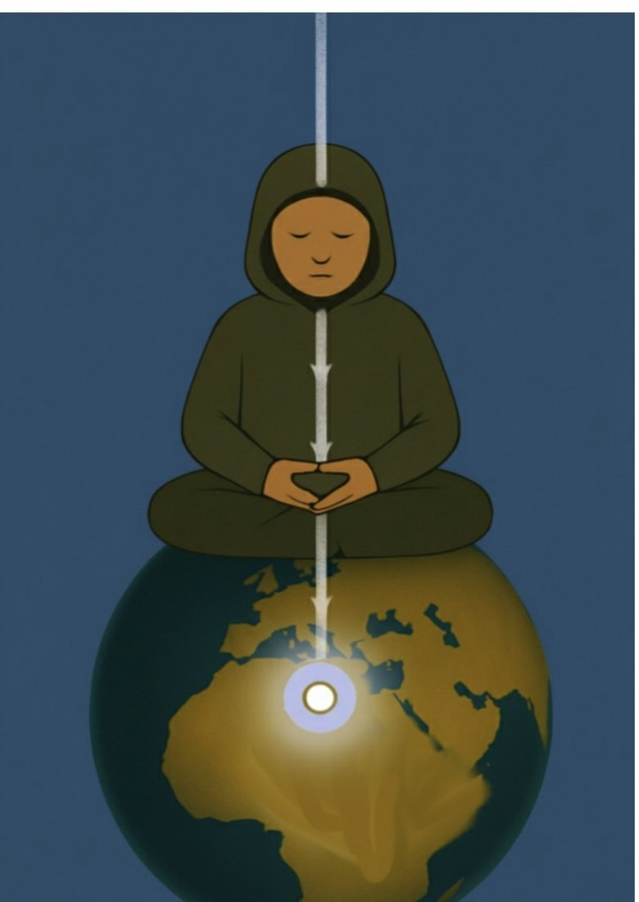
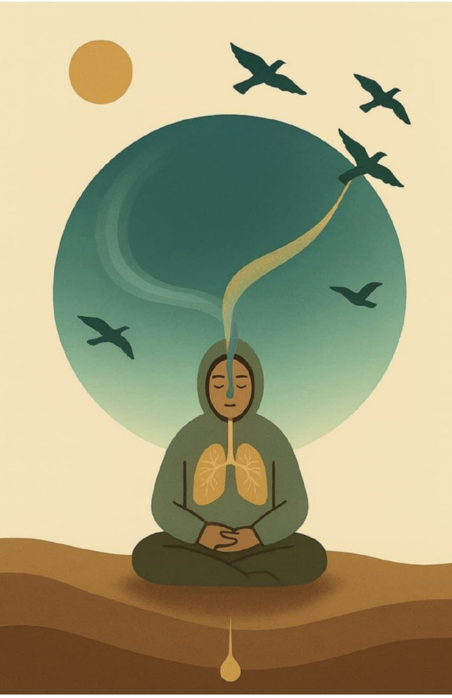
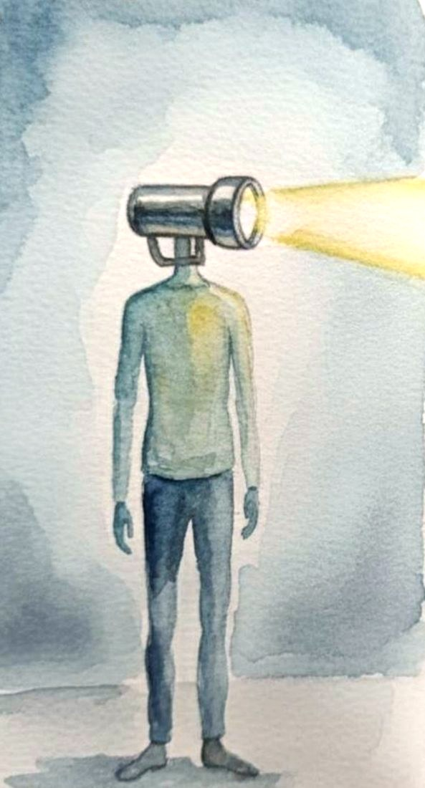
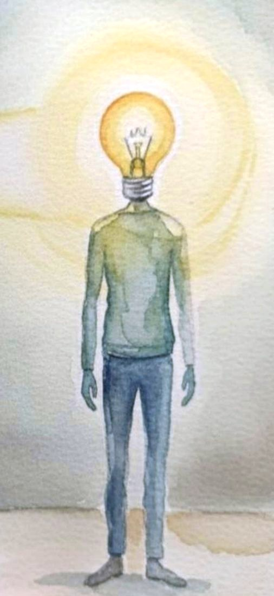

# Οδηγός Ενσυνειδητότητας για Νευροδιαφορετικούς

## Workbook Πρακτικής Παρουσίας

*Βασισμένο στον Τετραπλό Άξονα: Σώμα · Αναπνοή · Προσοχή · Χώρος*

**Θεόδωρος Μπαϊρακτάρης**

© 2025–2026 · CC BY-NC-ND 4.0 · Δεύτερη έκδοση

---

Συγγραφέας: Θεόδωρος Μπαϊρακτάρης
Έκδοση: Δεύτερη έκδοση, 2026

Αυτό το έργο προσφέρεται δωρεάν υπό τους όρους της άδειας Creative Commons
Attribution-NonCommercial-NoDerivatives 4.0 International License (CC BY-NC-ND 4.0).
Επιτρέπεται η κοινοποίηση με αναφορά στον δημιουργό. Απαγορεύεται η εμπορική
χρήση και η τροποποίηση.

> **Μια σημείωση πριν ξεκινήσεις.** Οι ασκήσεις που ακολουθούν είναι εργαλεία
> αυτορρύθμισης. Δεν αντικαθιστούν θεραπεία, διάγνωση ή φαρμακευτική αγωγή. Αν
> κάποια στιγμή τα συναισθήματα σε πλημμυρίσουν, ή αν νιώσεις έντονη δυσφορία,
> σταμάτα την άσκηση, άνοιξε τα μάτια και νιώσε τα πέλματα στο έδαφος. Η
> υποστήριξη ενός θεραπευτή μπορεί να αποδειχθεί πολύτιμη. Η πρακτική της
> παρουσίας έχει τη συμπόνια στον πυρήνα της.

---

# Πίνακας Περιεχομένων

**Εισαγωγή**
- Για Ποιον Είναι Αυτό το Βιβλίο — 4
- Μια Σημείωση για τη Σοφία του Σώματος — 4
- Προσωπική Σημείωση — 4
- Πώς Ορίζουμε την Ενσυνειδητότητα — 5
- Πώς να Χρησιμοποιήσεις Αυτόν τον Οδηγό — 6

**Μέρος 1: Ο Πυρήνας της Μεθόδου** — 7
- Κεφ. 1 — Σώμα: Η Σταθερότητα του «Εδώ» — 8
- Κεφ. 2 — Αναπνοή: Ο Ρυθμός της Ζωής — 11
- Κεφ. 3 — Προσοχή: Ο Φακός της Συνείδησης — 16
- Κεφ. 4 — Χώρος: Η Ανοιχτή Επίγνωση — 20

**Μέρος 2: Εφαρμογές & Μετασχηματισμός** — 27
- Κεφ. 5 — Ο Νευροδιαφορετικός Νους: Άμυνα, Τρέξιμο, Μάσκα — 28
- Κεφ. 6 — Στην Καθημερινή Ζωή: Αυτορρύθμιση — 33
- Κεφ. 7 — Όταν το Κύμα Ανεβαίνει — 39
- Κεφ. 8 — Φύλλο Εργασίας της Παρουσίας — 43
- Κεφ. 9 — Τα Τέσσερα Στάδια: Οδηγός Βήμα-Βήμα — 45
- Κεφ. 10 — Το Υπόβαθρο: Επιστήμη και Σοφία — 47

**Συμπληρωματικά**
- 7-Ήμερο Ημερολόγιο Πρακτικής — 93
- Γλωσσάρι — 95
- Παράρτημα — Η Κουνελότρυπα — 97
- Επίλογος — 99

---

# Εισαγωγή

## Για Ποιον Είναι Αυτό το Βιβλίο;

Αυτός ο οδηγός απευθύνεται σε όσους αισθάνονται αποσυνδεδεμένοι: σε όσους ο νους
τρέχει ασταμάτητα, το σώμα βρίσκεται σε συνεχή εγρήγορση και η γαλήνη μοιάζει με
ξένη γλώσσα.

Είναι ένα εργαλείο για άτομα που βιώνουν τον αντίκτυπο του τραύματος, τη
νευροδιαφορετικότητα (όπως η ΔΕΠΥ), ή απλώς τη χρόνια πίεση της σύγχρονης ζωής.

Δεν χρειάζεται να «διορθώσεις» κάτι σε εσένα, γιατί τίποτα δεν είναι σπασμένο. Ο
στόχος είναι να μάθεις να επιστρέφεις, απαλά και ευγενικά, στη ζωντανή σου
παρουσία.

## Μια Σημείωση για τη Σοφία του Σώματος

Ο νους δεν έχει αίσθηση του «τώρα». Ταξιδεύει διαρκώς ανάμεσα σε αναμνήσεις του
παρελθόντος και σε προβολές του μέλλοντος. Αντίθετα, το σώμα μας, μέσω της
αναμφίβολης βαρύτητας και της αναπνοής, είναι πάντα εδώ. Για όσους νιώσαμε
αποσυνδεδεμένοι, η επιστροφή στο παρόν δεν είναι απλώς μια ψυχολογική άσκηση,
αλλά ένα ενσώματο ταξίδι επανασύνδεσης.

## Προσωπική Σημείωση — Μια Διαδρομή, Όχι μια Θεωρία

Αυτός ο οδηγός δεν γεννήθηκε σε εργαστήριο ή ακαδημαϊκό γραφείο. Γεννήθηκε από
μια προσωπική ανάγκη. Όταν ο γιος μου πήρε τη διάγνωσή του, συνειδητοποίησα ότι
είμαι κι εγώ νευροδιαφορετικός. Μόνο που εμένα, παλιά, με χαρακτήριζαν
«υπερκινητικό».

Χρειαζόμασταν κάτι πρακτικό: μια μέθοδο αυτορρύθμισης που να μην απαιτεί να
πολεμήσουμε τον εγκέφαλό μας, αλλά να συνεργαστούμε μαζί του. Στράφηκα στην
ενσυνειδητότητα, γιατί είχα διαβάσει ότι βοηθά. Οι σύγχρονες μέθοδοι που βρήκα
ήταν φτιαγμένες στα μέτρα ενός νου που δεν έμοιαζε με τον δικό μου. Πήγα λοιπόν
να βρω την πηγή τους — και ήξερα πώς να την ψάξω, γιατί ο εσωτερισμός ήταν από
παιδί το ειδικό μου ενδιαφέρον.

Εκεί βρήκα το αντίστροφο από ό,τι περίμενα. Οι πηγές δεν ζητούσαν ήσυχο νου.
Έδιναν μέθοδο για να γνωρίσεις τον νου σου όπως είναι και να επανασυνδεθείς μαζί
του. Αυτό ακριβώς είχε πέσει έξω στη διαδρομή προς τις αραιωμένες εκδοχές — και
ήταν το μόνο που χρειαζόμουν.

Έμενε η μετάφραση. Όχι της μεθόδου, αλλά της μορφής της: οι παραδόσεις
προϋποθέτουν χρόνο, ακινησία, δάσκαλο παρόντα, χρόνια σταδιακής πορείας. Και δεν
απαντούν σε ερωτήματα που δεν τους τέθηκαν ποτέ — αισθητηριακή υπερφόρτωση,
υπερεστίαση, ένα σύστημα που σβήνει. Τι κρατάει από αυτές τις ασκήσεις όταν η
προσοχή δεν μένει πουθενά, όταν το σώμα είναι ήδη υπερφορτωμένο, όταν η ακινησία
είναι η ίδια δυσφορία.

Αυτό είναι το βιβλίο. Δεν είμαι δάσκαλος. Η πρακτική ήρθε από αλλού· η μετάφραση
είναι δική μου, και η ευθύνη της επίσης.

> «Δεν σταμάτησε το μυαλό μου να τρέχει, αλλά σταμάτησε να με παρασύρει.»

## Πώς Ορίζουμε την Ενσυνειδητότητα;

Η ενσυνειδητότητα δεν είναι ένα μυστηριώδες «κάτι» που πρέπει να επιτευχθεί.
Είναι η φυσική εμπειρία που προκύπτει όταν τα τέσσερα κύρια κέντρα συνείδησης
λειτουργούν ταυτόχρονα και αρμονικά.

**ΣΩΜΑ** — Η αίσθηση ότι κατοικείς σε ένα σώμα που αγγίζει, νιώθει και συνδέεται
με τη γη μέσω της βαρύτητας.

**ΑΝΑΠΝΟΗ** — Η επίγνωση του ρυθμού της ζωής σου, της συνεχούς ροής εισπνοής και
εκπνοής που σε συνδέει με τον κόσμο.

**ΠΡΟΣΟΧΗ** — Η ικανότητα να κατευθύνεις το φως της επίγνωσής σου: να εστιάζεις,
να ανοίγεις ή να παρατηρείς.

**ΧΩΡΟΣ** — Η αίσθηση του ανοιχτού πεδίου μέσα και γύρω σου, στο οποίο σκέψεις,
αισθήματα και αισθήσεις εμφανίζονται και εξαφανίζονται.

Όταν βρίσκεσαι υπό πίεση ή σε διάσπαση, αυτά τα κέντρα μπορεί να λειτουργούν
μεμονωμένα ή ακόμη και σε σύγκρουση. Η μέθοδος που ακολουθεί είναι απλή: να
έρθεις σε επαφή με κάθε κέντρο ξεχωριστά και, στη συνέχεια, να τα ρυθμίσεις ώστε
να λειτουργούν παράλληλα.

Δεν αλλάζεις τον εαυτό σου. Συντονίζεις και δίνεις χώρο σε ό,τι ήδη υπάρχει.

## Πώς να Χρησιμοποιήσεις Αυτόν τον Οδηγό

- Οι ασκήσεις έχουν χαρακτήρα παιχνιδιού. Δεν υπάρχουν λάθη, μόνο πειράματα.
- Η παρουσία δεν χρειάζεται να διαρκεί ώρες. Ξεκινά με νίκες λίγων δευτερολέπτων.
- Οι οδηγίες είναι σαφείς, αλλά μη διστάσεις να τις προσαρμόσεις στις ανάγκες σου.
- Η συνέπεια σε μικρές δόσεις είναι πιο σημαντική από τη διάρκεια.

Στο Κεφάλαιο 10 και στους πόρους στο τέλος του βιβλίου θα συναντήσεις ονόματα από
στοχαστικές παραδόσεις: τις πηγές των ασκήσεων και τους δασκάλους που τις
μετέδωσαν. Αναφέρονται εκεί όπως θα αναφέραμε τον ερευνητή μιας μελέτης. Καμία πεποίθηση δεν προαπαιτείται, και καμία
δεν προτείνεται. Η μέθοδος στέκεται εξ ολοκλήρου στην παρατήρηση και στη δική σου
εμπειρία.

Κάθε κεφάλαιο περιλαμβάνει **τέσσερις κλιμακωτές ασκήσεις**, από τη μία στιγμή
ως τα λίγα λεπτά, ώστε να μπορείς να ξεκινήσεις αμέσως. Το πλήρες, δομημένο
πρόγραμμα οκτώ εβδομάδων θα το βρεις στην εφαρμογή. Στο τέλος του βιβλίου θα
βρεις **Γλωσσάρι** με όλους τους όρους της μεθόδου. Αν κάπου συναντήσεις λέξη που
δεν θυμάσαι, είναι εκεί.

> **Συνοδευτική εφαρμογή.** Κάθε άσκηση αυτού του βιβλίου υπάρχει και σε
> διαδραστική, κινούμενη μορφή στο neurodivergent-mindfulness.org. Για ήχο
> (binaural beats και ήρεμα ηχοτοπία που βοηθούν τη ρύθμιση) δες τον χώρο ήχου
> της εφαρμογής. Η εφαρμογή είναι δωρεάν, χωρίς λογαριασμό και χωρίς
> παρακολούθηση.

---

# Μέρος 1 — Ο Πυρήνας της Μεθόδου

**Ο Τετραπλός Άξονας: Σώμα · Αναπνοή · Προσοχή · Χώρος**

Τα επόμενα τέσσερα κεφάλαια σε εισάγουν στα τέσσερα κέντρα συνείδησης που
αποτελούν τον πυρήνα αυτής της πρακτικής. Κάθε κεφάλαιο περιλαμβάνει θεωρητικό
υπόβαθρο, πρακτικές ασκήσεις και χώρο αναστοχασμού.

---

## Κεφάλαιο 1 — Σώμα: Η Σταθερότητα του «Εδώ»

> **Σε αυτό το κεφάλαιο**
> Το σώμα είναι η αναμφίβολη βάση της παρούσας στιγμής. Μαθαίνεις να
> αντιλαμβάνεσαι τη βαρύτητα, τη στάση σου και την επαφή με τον χώρο, ως
> αφετηρία κάθε πρακτικής.

*Γείωση μέσω βαρύτητας: η σταθερή μας βάση.*

### Η Αρχή: Χαλάρωση και Γείωση

Η πρακτική του Τετραπλού Άξονα ξεκινά πάντα με το σώμα. Το σώμα είναι η σταθερή
σου βάση, το αναμφίβολο «Εδώ» που σε συνδέει με τον παρόντα χρόνο. Ξεκινάμε με τη
συνειδητή γείωση, καθώς η χαλάρωση προηγείται της επίγνωσης.

Το σώμα σου δεν είναι απλώς ένα όχημα. Είναι ένα ζωντανό αρχείο των εμπειριών σου.
Η στάση που έχεις διαμορφώσει κουβαλά συχνά την απόρριψη, την απογοήτευση και την
ένταση που βίωσες επειδή ένιωθες διαφορετικός. Αυτές οι εμπειρίες «κλειδώνονται»
ως χρόνιο σφίξιμο στους ώμους, την πλάτη, τη λεκάνη και το σαγόνι.

### Η Βαρύτητα: Το Αναμφίβολο «Εδώ»

Η βαρύτητα δεν είναι απλώς μια δύναμη. Είναι η απόδειξη του «Εδώ». Σου δείχνει,
χωρίς καμία αμφιβολία, ακριβώς το σημείο στο οποίο μπορείς να υπάρξεις στον χώρο,
αυτή τη συγκεκριμένη στιγμή. Η γείωση είναι η πρώτη πράξη χαλάρωσης.

### Ο Στόχος σου

- **Όχι:** να πετύχεις μια συγκεκριμένη, τέλεια στάση.
- **Όχι:** να σταματήσεις τις σκέψεις.
- **Ναι:** να είσαι άνετος/η, γειωμένος/η και χαλαρός/ή μέσα στο σώμα σου.

### Το Σώμα, ο Χώρος και η Αίσθηση Ασφάλειας

Η βαθιά χαλαρότητα μέσα στο σώμα δεν είναι ποτέ μια απομονωμένη πράξη.
Προϋποθέτει πάντα την επίγνωση του χώρου. Το σώμα σου, μέσω των αισθητηρίων
οργάνων, σε πληροφορεί συνεχώς για τη θέση σου μέσα στον χώρο.

Όταν ο χώρος γίνεται αντιληπτός ως ανοιχτός και δεκτικός, το σώμα λαμβάνει την
άδεια να αφήσει το σφίξιμο και να χαλαρώσει. Η αληθινή γείωση επιτυγχάνεται μόνο
μέσα σε έναν χώρο που νιώθεις ότι σε χωρά. Το σώμα και ο χώρος συνεργάζονται.

### Απόδραση από τις Έννοιες

Όταν ο νους δεν έχει μια σταθερή, αναμφίβολη βάση στο παρόν, συχνά πέφτει στην
παγίδα της εσωτερικής ανάλυσης και των σεναρίων. Η εστίαση στη βαρύτητα σού δίνει
τη δυνατότητα να βγεις από αυτά τα νοητικά σενάρια.

Η ανάλυση και η παρατήρηση γίνονται με την ησυχία τους, αφού πρώτα υπάρξει η
σταθερότητα.

Εδώ αξίζει να ονομάσουμε δύο λειτουργίες που θα συναντάς σε όλο το βιβλίο. Ο
**Μηχανικός Νους** είναι το μέρος του νου που αναλύει το παρελθόν και σχεδιάζει
το μέλλον· χρήσιμο εργαλείο, αλλά χωρίς αίσθηση του τώρα. Ο **Ανοιχτός Νους**
είναι η συμπληρωματική του λειτουργία: παρατηρεί χωρίς να αναλύει, αγκαλιάζει
χωρίς να κρίνει, βλέπει πέρα από τα σενάρια. Το περιεχόμενο του Μηχανικού Νου
αναγνωρίζεται και αφήνεται, αν δεν είναι χρήσιμο ή αν είναι βλαβερό, χωρίς την
ανάγκη για ανάλυση. Θα τους ξανασυναντήσεις αναλυτικά στο Κεφάλαιο 5.

**Αναμφίβολο «Εδώ» και αδιάκοπη ροή.** Ενώ η βαρύτητα σού δίνει ένα ακλόνητο
«Εδώ», σε μεγαλύτερη κλίμακα υπάρχει μόνο κίνηση και ροή (όπως η Γη γύρω από τον
Ήλιο). Η ενσυνειδητότητα σε διδάσκει να αγκαλιάζεις και τους δύο πόλους: τη
σταθερότητα της βαρύτητας και την αδιάκοπη ροή της ζωής.

> **Σημαντική σημείωση για τον χρόνο.** Η αλλαγή της στάσης και της έντασης
> παίρνει αρκετό χρόνο. Η συνήθεια έχει χτιστεί επί χρόνια και το σώμα έχει
> καλουπωθεί. Μη βιαστείς και μην πιέζεις τον εαυτό σου. Η επιμονή στην ηπιότητα
> είναι η μεγαλύτερη πράξη αυτορρύθμισης.

### Πρακτική Άσκηση: Το Βιβλίο / Κουτί

- **Θέση:** Στάσου όρθιος/η με άνεση.
- **Εργαλείο (προαιρετικό):** Πάρε ένα βιβλίο ή κουτί και τοποθέτησέ το στο
  κεφάλι σου.
- **Εστίαση:** Παρατήρησε πώς χρειάζεται να σταθείς για να μην πέσει. Νιώσε πώς
  το βάρος κατεβαίνει ομαλά μέσα από τον λαιμό, τη σπονδυλική στήλη και τη λεκάνη.
- **Αίσθηση:** Νιώσε το βάρος, την αφή των πελμάτων στο έδαφος και την αίσθηση
  του άξονα που σε κρατά όρθιο/η.

*Στην εφαρμογή: Άσκηση γείωσης με καθοδήγηση · Μικρο-δόσεις σώματος · για κίνηση,
Λίκνισμα και Cloud Hands (Tai Chi).*

**Αναστοχασμός:** Μετά την άσκηση, τι παρατήρησα στο σώμα μου;

### Τέσσερις Ασκήσεις για τη Γη

Από τη μία στιγμή ως τα λίγα λεπτά. Ξεκίνα από όποια σε βολεύει.

1. **Η πτώση του βάρους** *(1 δευτερόλεπτο)* — Όπου κι αν βρίσκεσαι, σταμάτα για
   μία στιγμή και άσε το βάρος σου να «πέσει» προς τη γη. Αυτό είναι όλο.
2. **Τα πέλματα** *(20 δευτερόλεπτα)* — Φέρε την προσοχή στα πέλματα. Νιώσε την
   επαφή με το έδαφος, το βάρος να μοιράζεται, τη γη να σε κρατά.
3. **Ο άξονας** *(1 λεπτό)* — Νιώσε τη νοητή κατακόρυφη γραμμή από την κορυφή του
   κεφαλιού ως τα πέλματα. Με κάθε εκπνοή, χαλάρωσε σαγόνι και ώμους γύρω της.
4. **Αργό περπάτημα** *(2–3 λεπτά)* — Περπάτα πιο αργά απ' το συνηθισμένο,
   νιώθοντας κάθε πέλμα να ακουμπά και να σπρώχνει. Η γη σε κρατά σε κάθε βήμα.

> ★ **Βασικό Σημείο:** Η βαρύτητα είναι πάντα εδώ. Το σώμα είναι πάντα εδώ. Αυτό
> είναι αρκετό για να ξεκινήσουμε.

---

## Κεφάλαιο 2 — Αναπνοή: Ο Ρυθμός της Ζωής

> **Σε αυτό το κεφάλαιο**
> Η αναπνοή σε συνδέει με τον ρυθμό της ζωής και διδάσκει την αποδοχή της
> παροδικότητας. Κάθε εισπνοή και εκπνοή είναι μια μικρή πρόβα αρχής και τέλους.

*Η αναπνοή ως γέφυρα μεταξύ σώματος και κόσμου.*

Αν το σώμα σε ενώνει με τη γη, η αναπνοή σε συνδέει με τον αέρα και την αδιάκοπη
ροή του κόσμου. Είναι ο ρυθμός που σε συνοδεύει από τη γέννηση μέχρι το τέλος.

### Ο Ρυθμός της Ύπαρξης

Η παρατήρηση της αναπνοής σού διδάσκει τον φυσικό ρυθμό της ύπαρξης και την
αποδοχή της παροδικότητας. Κάθε εισπνοή συγκρατείται για μια στιγμή και στη
συνέχεια αφήνεται με την εκπνοή.

- **ΕΙΣΠΝΟΗ — Η Αρχή:** η γέννηση, η λήψη.
- **ΠΑΥΣΗ — Η Στιγμή:** η ύπαρξη στο τώρα.
- **ΕΚΠΝΟΗ — Το Τέλος:** η απελευθέρωση, η αποδοχή.

Αυτό είναι κρίσιμο για τον νευροδιαφορετικό νου: όταν νιώθεις ένα έντονο
συναίσθημα, ο νους το ερμηνεύει ως μόνιμο. Παρατηρώντας τον ρυθμό της αναπνοής,
μαθαίνεις ότι κάθε κατάσταση είναι παροδική.

### Η Πράξη της Παρατήρησης — Εσωτερική Αφή

Το πρώτο βήμα είναι η αποδοχή. Δεν χρειάζεται να ελέγξεις την αναπνοή σου. Αρκεί
να την παρατηρήσεις όπως είναι: βαθιά ή ρηχή, αργή ή γρήγορη, ελεύθερη ή
σφιγμένη. Παρατήρησε:

- Την αίσθηση του αέρα που αγγίζει τα ρουθούνια.
- Τη διαστολή και συστολή του θώρακα.
- Την κίνηση της κοιλιάς.
- Τη μικρή αλλαγή στη στάση του σώματος με κάθε εισπνοή και εκπνοή.

**Η αναπνοή ως δείκτης.** Αν είναι σφιγμένη ή ρηχή, δείχνει ένταση. Αν είναι αργή
και βαθιά, δείχνει χαλάρωση. Η αναπνοή είναι ο δείκτης της ψυχικής σου κατάστασης.

### Οι Τρεις Ρυθμοί

Σε όλο το βιβλίο θα συναντήσεις τρεις ρυθμούς αναπνοής. Δεν είναι ανταγωνιστικοί:
ο καθένας έχει τη δουλειά του.

| Ρυθμός | Πότε | Τι κάνει |
|---|---|---|
| **5-5** (εισπνοή 5, εκπνοή 5) | καθημερινά, σε ουδέτερη κατάσταση | ισορροπία και σταθεροποίηση· ο άστατος αέρας γίνεται ρεύμα |
| **4-6** (εισπνοή 4, εκπνοή 6) | στην κορύφωση, όταν ο άνεμος δυναμώνει | η μακρύτερη εκπνοή λέει στο νευρικό σύστημα «είμαστε ασφαλείς» |
| **4-2-7** (εισπνοή 4, κράτημα 2, εκπνοή 7) | σε ήσυχη στιγμή, για βαθιά χαλάρωση | παύση και πολύ μακριά εκπνοή· ο πιο έντονος ρυθμιστής |

*Στην εφαρμογή θα βρεις και την παραλλαγή 4-7-8, που δουλεύει με την ίδια αρχή
όπως το 4-2-7: μακριά εκπνοή μετά από παύση.*

Ένας κανόνας που ισχύει και για τους τρεις: **η εκπνοή είναι το εργαλείο, όχι η
εισπνοή.** Δεν χρειάζεται ποτέ να πιέσεις τον αέρα μέσα.

### Ρύθμιση σε Έντονο Άγχος

Σε στιγμές έντονου άγχους ή υπερφόρτωσης, η αναπνοή μπορεί να γίνει άμεσο
εργαλείο ρύθμισης. Άφησε την εκπνοή να βγαίνει από το στόμα, λίγο πιο αργά και
παρατεταμένα. Επίτρεψε στην κοιλιά να μαλακώσει και να συσπαστεί ελαφρά προς τα
μέσα.

### Οι Άνεμοι του Συναισθήματος

Είδαμε την αναπνοή ως δείκτη. Υπάρχει όμως και μια δεύτερη, παλιά ανάγνωση: τα
συναισθήματα είναι άνεμοι. Δεν είναι ιδέες στο κεφάλι, είναι καιρικά φαινόμενα
στο σώμα και στην αναπνοή. Εκεί μπορείς να τα διαβάσεις, πριν βρεις λέξεις γι'
αυτά.

- **Θυμός** — δυνατός, ανοδικός άνεμος: φουσκώνει το στήθος, ανεβάζει και
  ρηχαίνει την αναπνοή.
- **Άγχος** — άνεμος που αλλάζει διαρκώς κατεύθυνση: αναπνοή άστατη, κοντή, χωρίς
  ρυθμό.
- **Λύπη** — άπνοια και υγρασία: ο αέρας βαραίνει, η αναπνοή αραιώνει, με
  αναστεναγμούς που έρχονται μόνοι τους.
- **Μούδιασμα** — πυκνή ομίχλη σε ακίνητο αέρα: αναπνοή τόσο αχνή που σχεδόν
  ξεχνιέται.
- **Γαλήνη και χαρά** — ελαφρύ, σταθερό αεράκι: αναπνοή βαθιά και αβίαστη. Ο
  χάρτης δεν έχει μόνο κακοκαιρία.

Αν η ερώτηση «τι νιώθεις;» σού φέρνει κενό, δεν σου λείπει κάτι. Απλώς σου
ζητούσαν να μεταφράσεις τον καιρό σε λόγια, χωρίς να σου μάθουν πρώτα να τον
παρατηρείς.

**Πρώτα διαβάζεις τον καιρό.** Τι άνεμος είναι; Πού τον νιώθω στο σώμα; Πόση ώρα
φυσάει; Χωρίς «γιατί», χωρίς ιστορίες. Μόνο ο καιρός, τώρα. Η αναγνώριση είναι
ήδη ρύθμιση: ένας άνεμος που τον έχεις δει δεν σε κυβερνά όπως ένας άνεμος που
αρνείσαι ότι φυσάει.

**Μετά συνοδεύεις τον άνεμο.** Δεν τον σταματάς, του δίνεις ρυθμό:

- Στην κορύφωση (θυμός που ανεβαίνει, άγχος που ξεφεύγει): **4-6**.
- Όταν κοπάσει λίγο: **5-5**.
- **Ψάλσιμο ή βουητό (humming) πάνω στην εκπνοή:** μακριά εκπνοή με δόνηση. Το
  σώμα ηρεμεί το σώμα. Αν βουίζεις ήδη ενστικτωδώς όταν πιέζεσαι, το ήξερες πριν
  το διαβάσεις.

### Ριπές, Συστήματα, Κλίμα

Μια τίμια κουβέντα: δεν υπακούν όλοι οι άνεμοι στα ίδια εργαλεία.

- **Ριπές (λεπτά):** ένας ξαφνικός εκνευρισμός, ένα κύμα άγχους. Η αναπνοή τα
  μαλακώνει άμεσα.
- **Συστήματα καιρού (μέρες):** ο θυμός ή ο πόνος μετά από μια απόρριψη μπορεί να
  φυσάει και αύριο. Αν οι αναπνοές δεν τον σβήσουν, δεν απέτυχες: αυτός ο άνεμος
  έχει τη δική του διάρκεια. Εδώ ο στόχος αλλάζει. Όχι να αλλάξεις τον καιρό,
  αλλά να κρατήσεις το σκάφος πλεύσιμο. Φαγητό, ύπνος, ένας άνθρωπος να μιλήσεις,
  ξανά ανάγνωση του καιρού. Αυτό είναι επιτυχία.
- **Κλίμα (χρόνια):** τα μακριά μοτίβα που έρχονται από παλιά. Δεν λύνονται σε μια
  μέρα, και για τα βαθύτερα αξίζει συνοδεία από επαγγελματία. Όμως το να ξέρεις το
  κλίμα σου αλλάζει το ενδιάμεσο: όταν ο άνεμος σηκώνεται δυσανάλογα με την
  αφορμή, δεν συμπεραίνεις «κάτι δεν πάει καλά με μένα», αναγνωρίζεις «αυτό το
  μοτίβο το ξέρω». Ο πόνος μένει· φεύγει ο δεύτερος πόνος, η σύγχυση και η
  αυτοκατηγορία.

Τίποτα από αυτά δεν σημαίνει ότι είσαι χαλασμένος/η. Σημαίνει ότι έχεις καιρό,
όπως όλοι. Τώρα έχεις και χάρτη.

*Στην Κουνελότρυπα: Μαθαίνοντας να ιππεύεις τον άνεμο — η αναπνοή και ο νους ως
άνεμος και καβαλάρης στην παράδοση του τσα λουνγκ.*

### Πρακτική Άσκηση: Η Ενεργή Επιστροφή

- **Γείωση (Σώμα):** Στάσου όρθιος/η ή κάθισε άνετα. Νιώσε τη βαρύτητα, την επαφή
  με το έδαφος.
- **Επίγνωση (Αναπνοή):** Στρέψε την προσοχή στην εισπνοή και εκπνοή. Νιώσε τον
  αέρα που αγγίζει τα ρουθούνια.
- **Στην εκπνοή:** Άφησε την κοιλιά να μαζευτεί ήπια προς τα μέσα, σαν να βγάζεις
  όλη την ένταση μαζί με τον αέρα.
- **Αποδοχή:** Μην προσπαθήσεις να αλλάξεις την αναπνοή. Αρκεί η επίγνωση.
- **Ρύθμιση (προαιρετικό):** Αν νιώθεις πολύ άγχος, πέρασε στον ρυθμό 4-6, με την
  εκπνοή να βγαίνει από το στόμα.

### Ο Άξονας της Παρουσίας

Με την κίνησή της, η αναπνοή δυναμώνει τον άξονα της παρουσίας που στηρίζεται στη
βαρύτητα. Λειτουργεί σαν αντίβαρο απέναντι στη ροή των σκέψεων: ενώ το μυαλό
μπορεί να τρέχει, η αναπνοή στηρίζει το σώμα στο τώρα.

Το εργαλείο εδώ είναι διπλό: να αναγνωρίζεις τον ρυθμό και την ποιότητα της
αναπνοής σου, και να νιώθεις πώς η κίνησή της στηρίζει τον άξονα σώμα–βαρύτητα,
επαναφέροντάς σε απέναντι στη ροή των σκέψεων.

Η αναπνοή σε διδάσκει να παρατηρείς χωρίς να επεμβαίνεις. Αυτή η ικανότητα είναι
η γέφυρα για το επόμενο βήμα: την Προσοχή.

*Στην εφαρμογή: Καθοδηγούμενη αναπνοή με κινούμενο οδηγό εισπνοής/εκπνοής ·
Μικρο-δόσεις αναπνοής.*

**Αναστοχασμός:** Πώς ήταν η αναπνοή μου στην άσκηση; (γρήγορη/αργή, ρηχή/βαθιά,
σφιγμένη/ελεύθερη)

### Τέσσερις Ασκήσεις για τον Αέρα

1. **Μία αναπνοή** *(1 αναπνοή)* — Παρατήρησε μία μόνο εισπνοή και εκπνοή, χωρίς
   να αλλάξεις τίποτα. Απλώς δες την όπως είναι.
2. **Ο αέρας στα ρουθούνια** *(30 δευτερόλεπτα)* — Νιώσε το δροσερό ρεύμα στην
   εισπνοή, το πιο ζεστό στην εκπνοή. Μόνο το σημείο όπου ο αέρας αγγίζει.
3. **Μαλακή κοιλιά** *(1 λεπτό)* — Άσε την κοιλιά να μαλακώσει. Στην εκπνοή, βγάλε
   τον αέρα αργά από το στόμα (ρυθμός 4-6). Νιώσε την κοιλιά να μαζεύεται ήπια.
4. **Βουητό στην εκπνοή** *(1–2 λεπτά)* — Πάρε μια ήσυχη εισπνοή και, στην εκπνοή,
   βγάλε ένα απαλό «μμμ». Νιώσε τη δόνηση. Το σώμα ηρεμεί το σώμα.

> ★ **Βασικό Σημείο:** Παρατηρώ χωρίς να επεμβαίνω. Κάθε αναπνοή είναι μια νέα
> αρχή. Το εργαλείο είναι πάντα η εκπνοή.

---

## Κεφάλαιο 3 — Προσοχή: Ο Φακός της Συνείδησης

> **Σε αυτό το κεφάλαιο**
> Η προσοχή είναι ο φακός του νου: μπορεί να εστιάζει, να ανοίγει, να διασπάται ή
> να αγκυλώνεται. Μαθαίνεις να αναγνωρίζεις πού βρίσκεται και να την επιστρέφεις
> απαλά, χωρίς αυτοκριτική.

*Η προσοχή ως φακός που φωτίζει την παρούσα στιγμή.*

Η προσοχή είναι το τρίτο κέντρο συνείδησης και το εργαλείο που καθορίζει πού θα
σταθεί ο νους. Το σώμα είναι η βάση, η αναπνοή ο ρυθμός, και η προσοχή είναι ο
φακός που φωτίζει την παρούσα στιγμή.

### Οι Τέσσερις Μορφές Προσοχής

**Κλειστή Προσοχή.** Η δέσμη μαζεύεται σε ένα σημείο. Χρήσιμη για συγκέντρωση.
Π.χ. κοιτάς σταθερά ένα αντικείμενο.

**Ανοιχτή Προσοχή.** Η δέσμη ανοίγει και φωτίζει πολλά μαζί. Ακούς τους ήχους,
νιώθεις το σώμα, αναπνέεις. Όλα χωράνε στην ίδια επίγνωση.

**Διασπασμένη Προσοχή.** Η προσοχή μοιάζει με μαϊμού που πηδά από κλαδί σε κλαδί.
Ο στόχος δεν είναι να τη «σκοτώσεις» αλλά να τη χαλιναγωγήσεις απαλά.

**Αγκυλωμένη Προσοχή.** Η δέσμη κολλάει σε εξωτερικό αντικείμενο ή σε ψυχικό
περιεχόμενο: μια σκέψη, μια ανησυχία. Η υπερβολική αυτοαναφορικότητα («γιατί
νιώθω έτσι; τι σημαίνει αυτό;») είναι η χαρακτηριστική της μορφή. Είναι η
κατάσταση που αξίζει τη μεγαλύτερη προσοχή, και σε αυτήν αφιερώνεται η επόμενη
ενότητα.

### Οι Φαύλοι Κύκλοι: «Αλλιώς» και «Έπρεπε»

Πού ακριβώς αγκυλώνεται η δέσμη; Τις περισσότερες φορές, σε δύο μοτίβα:

- **«Πώς θα μπορούσαν να ήταν τα πράγματα»** — ο νους ξαναπαίζει το παρελθόν με
  άλλο σενάριο: αν είχα πει, αν είχα κάνει, αν είχε γίνει αλλιώς.
- **«Πώς θα έπρεπε να είναι τα πράγματα»** — ο νους συγκρίνει το πραγματικό με ένα
  ιδεατό: έτσι έπρεπε να είναι η μέρα, η δουλειά, οι άλλοι, εγώ.

Αυτά τα μοτίβα είναι κύκλοι που δεν οδηγούν πουθενά. Όχι από αδυναμία, αλλά από
κατασκευή: συγκρίνουν το πραγματικό με κάτι που δεν υπάρχει, και το ανύπαρκτο δεν
απαντά ποτέ. Η δέσμη μπορεί να γυρίζει στην ίδια τροχιά για ώρες χωρίς να φτάνει
κάπου.

Και κάνουν κάτι ακόμη: **συντηρούν και μεγαλώνουν τα συναισθήματα.** Θυμήσου τους
ανέμους του προηγούμενου κεφαλαίου. Ένας άνεμος που θα κόπαζε μόνος του σε λίγα
λεπτά, με τον κύκλο ξαναφουσκώνει κάθε φορά που πάει να πέσει. Ο κύκλος είναι το
φυσερό του ανέμου. Γι' αυτό κάποια συναισθήματα κρατούν μέρες: δεν φυσάει ο
καιρός, φυσάμε εμείς.

Η έξοδος δεν είναι να αναλύσεις τον κύκλο· το «γιατί το σκέφτομαι αυτό;» είναι κι
αυτό κύκλος. Η έξοδος είναι η αναγνώριση της τροχιάς: βλέπεις ότι η δέσμη μπήκε
στη γνωστή στροφή, της βάζεις ταμπέλα, «Αλλιώς» ή «Έπρεπε», και επιστρέφεις απαλά
στο σταθερό σημείο. Δεν χρειάζεται να κερδίσεις τη συζήτηση με το ανύπαρκτο.
Αρκεί να δεις ότι είναι συζήτηση με το ανύπαρκτο.

Αν αυτοί οι κύκλοι σού είναι πολύ οικείοι, δεν είναι ελάττωμα λογικής. Είναι
υπερλειτουργία μιας ικανότητας. Ο νους που τρέχει σενάρια είναι ο ίδιος νους που
προβλέπει, σχεδιάζει, δημιουργεί. Και το «έπρεπε» συχνά δεν είναι καν δικό σου:
είναι χρόνια προσδοκιών των άλλων που μιλούν με τη φωνή σου. Δεν πολεμάμε τη
μηχανή των σεναρίων· μαθαίνουμε να βλέπουμε πότε γυρίζει στο κενό.

### Η Τετραπλή Προσοχή

Σε αυτό το στάδιο, η προσοχή γίνεται τετραπλή. Κρατάς ταυτόχρονα επίγνωση
τεσσάρων επιπέδων:

- **Σώμα** — που δίνει βάση και σταθερότητα στην παρούσα στιγμή.
- **Αναπνοή** — που δίνει ρυθμό και επαναφέρει στο τώρα.
- **Ίδια η Προσοχή** — που μαθαίνει να σταθεροποιείται, να παρατηρεί πού πηγαίνει.
- **Σκέψεις** — που αναγνωρίζονται χωρίς να παρασύρουν, απλώς παρατηρούνται.

### Η Δύναμη της Ταμπέλας (thought labelling)

Όταν μια σκέψη σε τραβάει, το να επιστρέψεις απλώς στην αναπνοή μπορεί να είναι
δύσκολο. Η **ετικετοποίηση** σού δίνει ένα ενδιάμεσο βήμα: αντί να εμπλακείς στο
περιεχόμενο της σκέψης, βάλε της μια απλή, μονολεκτική ταμπέλα και μετά επέστρεψε
στο σταθερό σημείο.

- Σκέφτεσαι τι πρέπει να κάνεις αύριο → «Σχεδιασμός»
- Σκέφτεσαι κάτι που είπες και ήταν λάθος → «Κριτική» ή «Παρελθόν»
- Ανησυχείς για κάτι μελλοντικό → «Ανησυχία» ή «Σενάριο»

### Πρακτική Άσκηση: Σταθεροποίηση του Φακού

- **Σώμα & Αναπνοή:** Στάσου ή κάθισε με άνεση. Κλείσε τα μάτια. Νιώσε το σώμα
  σου και τον ρυθμό της αναπνοής.
- **Σταθερό Σημείο:** Άνοιξε τα μάτια και επίλεξε ένα σημείο εστίασης (οπτικό,
  ακουστικό ή σωματικό).
- **Τετραπλή Επίγνωση:** Κράτησε την προσοχή εκεί, διατηρώντας παράλληλα επίγνωση
  σώματος, αναπνοής και σκέψεων.
- **Απαλή Επιστροφή:** Αν παρασυρθείς, αναγνώρισέ το (με ταμπέλα αν χρειάζεται)
  και επέστρεψε απαλά: σώμα → αναπνοή → σταθερό σημείο.

*Στην εφαρμογή: Μικρο-δόσεις προσοχής για την εξάσκηση του φακού.*

*Στην Κουνελότρυπα: Το Μαλακό Βλέμμα — πώς η περιφερειακή όραση και η ανοιχτή
ακοή ρυθμίζουν το νευρικό σύστημα.*

**Αναστοχασμός:** Το ταξίδι της προσοχής μου — πού τείνει να «κολλάει» ή να
«τρέχει»;

### Τέσσερις Ασκήσεις για τη Φωτιά

1. **Η οπτική άγκυρα** *(10 δευτερόλεπτα)* — Διάλεξε ένα ήσυχο σημείο μπροστά σου
   και κοίταξέ το με απαλό, σταθερό βλέμμα. Όταν φύγεις, γύρνα απαλά.
2. **Ετικέτα και επιστροφή** *(30 δευτερόλεπτα)* — Όταν μια σκέψη σε τραβήξει,
   δώσ' της μια λέξη («Σχεδιασμός», «Ανησυχία») και γύρνα στο σημείο σου.
3. **Τριπλή εστίαση** *(1 λεπτό)* — Κράτα ταυτόχρονα τρία πράγματα: τα πέλματα,
   την αναπνοή, και το σημείο μπροστά σου. Αν χαθεί ένα, ξαναφέρ' το.
4. **Εναλλαγή φακού** *(1–2 λεπτά)* — Εστίασε στενά σε ένα σημείο· μετά άνοιξε το
   βλέμμα να χωρέσει όλο το δωμάτιο· μετά ξανά στενά. Ζουμ μέσα, ζουμ έξω.

> ★ **Βασικό Σημείο:** Η επιστροφή της προσοχής δεν είναι αποτυχία, είναι η ίδια
> η άσκηση. Κάθε «απαλή επιστροφή» χτίζει νέες νευρικές διαδρομές.

---

## Κεφάλαιο 4 — Χώρος: Η Ανοιχτή Επίγνωση

> **Σε αυτό το κεφάλαιο**
> Τα τρία πρώτα κέντρα ήταν κάτι που κάνεις. Ο Χώρος είναι κάτι που ήδη υπάρχει.
> Εδώ γνωρίζεις την επίγνωση, το ανοιχτό πεδίο μέσα στο οποίο συμβαίνει η
> εμπειρία, και μαθαίνεις να αναπαύεσαι σε αυτό.

*Ο χώρος σού δίνει τη δυνατότητα να τα χωρέσεις όλα.*

Το Σώμα σού έδωσε σταθερότητα, η Αναπνοή ρυθμό, η Προσοχή την επιστροφή. Και τα
τρία είναι πράξεις, κάτι που κατευθύνεις. Το τέταρτο είναι διαφορετικής φύσης:
όχι μια ακόμα τεχνική, αλλά η ανακάλυψη του πεδίου μέσα στο οποίο δούλευαν οι
τρεις πρώτες.

### Πώς Οδηγείς

Σκέψου πώς οδηγείς. Η προσοχή σου είναι κλειστή στον δρόμο μπροστά· εκεί κρατάς
την ακρίβεια. Μαζί, μια ανοιχτή, περιφερειακή προσοχή βλέπει πιο μακριά, δεξιά,
αριστερά· και ανά διαστήματα, οι καθρέφτες, πίσω. Μπροστά, γύρω, πίσω, όλα μαζί.
Δεν είναι δύο δεξιότητες που εναλλάσσεις· είναι μία επαφή με τον κόσμο, όπου η
κλειστή προσοχή δίνει το σημείο και η ανοιχτή τον χώρο μέσα στον οποίο το σημείο
έχει νόημα.

Αν δεν οδηγείς, το ίδιο κάνεις όταν περπατάς σε πολυσύχναστο μέρος, στο μετρό ή σε
μια γεμάτη πλατεία: κοιτάς πού πατάς, αλλά ταυτόχρονα υπολογίζεις πανοραμικά όλη
την κίνηση γύρω σου για να βρεις πώς θα περάσεις. Σημείο και χώρος, μαζί.

Πρόσεξε τι γίνεται όταν «φεύγεις» σε μια σκέψη. Η περιφέρεια σβήνει, οι καθρέφτες
ξεχνιούνται, και το πιο ύπουλο: ακόμα κι εκείνο το μπροστά θολώνει. Δεν αντάλλαξες
πλάτος για ακρίβεια· τα έχασες και τα δύο. Την ανοιχτή επίγνωση την ξέρεις ήδη·
απλώς την ξεχνάς όταν κλείνεσαι.

### Το Σημείο και το Πεδίο

Η **προσοχή** είναι το σημείο. Παίρνει πάντα ένα τοπικό, οριοθετημένο κομμάτι
(ένα δωμάτιο, μια περιοχή, μια σκέψη), του δίνει όνομα και σύνορο, και
κουράζεται, γιατί δουλεύει. Η **επίγνωση** είναι το πεδίο μέσα στο οποίο κινείται
το σημείο: ο συμπαντικός χώρος, χωρίς σύνορο, χωρίς όνομα, χωρίς σαφές όριο. Δεν
διαλέγει, δεν κρατά τίποτα· απλώς γνωρίζει, γι' αυτό δεν κουράζει. Η διαφορά δεν
είναι το μέγεθος: μια χώρα είναι τεράστια, αλλά παραμένει οριοθετημένη. Η επίγνωση
δεν είναι μεγαλύτερο κομμάτι· είναι το άνευ ορίου μέσα στο οποίο χωρούν όλα τα
κομμάτια.

Η συνηθισμένη μας κατάσταση είναι η απορρόφηση στα περιεχόμενα: μια σκέψη έρχεται
και γινόμαστε η σκέψη. Το τέταρτο βήμα είναι μια μετατόπιση του κέντρου: από το
σημείο, στο πεδίο. Ως τώρα ήσουν ο φακός που κινείται από αντικείμενο σε
αντικείμενο· τώρα, ανοίγοντας την περιφέρεια με κέντρο τον άξονα της βαρύτητας,
γίνεσαι ο χώρος όπου ο φακός δουλεύει. Στην εμπειρία, δεν προσθέτεις τίποτα·
σταματάς να το σκεπάζεις.

Είναι μια μετατόπιση από το **εγωκεντρικό** στο **χωροκεντρικό**. Εγωκεντρικά,
όλα περιστρέφονται γύρω μου. Χωροκεντρικά, εγώ κινούμαι μέσα σε κάτι απέραντο,
και το καθένα υπάρχει με τον δικό του ρυθμό, ανεξάρτητα από μένα. Όπως, στην
αλήθεια, δεν «ανατέλλει ο ήλιος»· η γη γυρίζει και με φέρνει στο φως.

Γι' αυτό χρειάστηκαν πρώτα τα τρία βήματα: η άσκηση σταθεροποιεί το έδαφος, και
πάνω σε σταθερό έδαφος η επίγνωση αναγνωρίζεται από μόνη της. Πρώτα η γη, μετά ο
ουρανός.

### Την Έχεις Ήδη Συναντήσει

Θυμήσου την «απαλή επιστροφή» του Κεφαλαίου 3. Ο νους παρασύρεται, και κάποια
στιγμή έρχεται εκείνο το «α, είχα χαθεί». Την επιστροφή την έκανες εσύ. Αλλά τη
στιγμή της αναγνώρισης δεν την έκανε κανείς· αν μπορούσες να την αποφασίσεις, δεν
θα είχες χαθεί. Αναδύθηκε μόνη της.

Οι ερευνητές της περιπλάνησης του νου την ονομάζουν **μετα-επίγνωση**: τη στιγμή
που ο νους αντιλαμβάνεται μόνος του πού βρίσκεται. Κανείς δεν την παράγει·
εμφανίζεται. Το τέταρτο στάδιο δεν σου ζητά να αποκτήσεις κάτι νέο· σου ζητά να
προσέξεις αυτό που σε ειδοποιούσε από την αρχή.

### Το Τούνελ: Πηγή που Θέλει Φροντίδα

Αυτή η κλειστή, έντονη εστίαση, το τούνελ, δεν είναι εχθρός. Για πολλούς από εμάς
είναι το ισχυρότερο εργαλείο που έχουμε: ο τόπος όπου συγκεντρωνόμαστε,
δουλεύουμε, δημιουργούμε. Το ζήτημα δεν είναι να το εγκαταλείψεις, αλλά αν σε
φροντίζει όσο είσαι μέσα του: αν πατάει σε γειωμένο σώμα και ξεκούραση, ή αν σε
καίει.

Όταν μένει αφρόντιστο, χωρίς σώμα και ανάσα, η περιφέρεια σβήνει και το κέντρο
θολώνει· εκεί σταματά να είναι πηγή και γίνεται παγίδα. (Το ίδιο και στο έντονο
άγχος: ο νους στενεύει και μεγεθύνει την απειλή — Κεφάλαιο 7.) Το τέταρτο βήμα δεν
σβήνει το τούνελ· το φροντίζει. Ανοίγεις την περιφέρεια, γειώνεσαι, ξεκουράζεσαι,
και ξαναμπαίνεις καθαρός, όχι καμένος. Η ανοιχτή επίγνωση δεν αντικαθιστά την
εστίαση· είναι ο τόπος όπου η εστίαση ξαναγεμίζει.

### Ο Χώρος που Κατοικεί στην Αλήθεια

Αυτό το πεδίο δεν το φαντάζεσαι. Οι τέσσερις άγκυρες δεν είναι κατασκευές του
νου: η γη σε κρατά με τη βαρύτητά της είτε τη θυμάσαι είτε όχι, ο αέρας
μπαινοβγαίνει μόνος του, το φως και ο χώρος υπάρχουν πριν από σένα. Είναι
αλήθειες, όχι εικόνες, γι' αυτό έχουν σταθερότητα και ρυθμό. Μια εικόνα που
φτιάχνεις τρεμοπαίζει και θέλει προσπάθεια· μια αλήθεια απλώς είναι εκεί. Δεν την
κρατάς εσύ, σε κρατά εκείνη.

Εδώ κρύβεται η πιο συνηθισμένη παρανόηση. Άλλο ο χώρος που φτιάχνει ο νους, μια
όμορφη γαλάζια απεραντοσύνη που ζωγραφίζεις, που είναι απλώς ένα ακόμα
περιεχόμενο. Κι άλλο ο χώρος που κατοικεί στην αλήθεια: ο πραγματικός χώρος που σε
περιβάλλει τώρα. Τον πρώτο τον φαντάζεσαι· τον δεύτερο τον κατοικείς. Ο ουρανός
εδώ είναι δείκτης, όχι προορισμός, σαν το δάχτυλο που δείχνει το φεγγάρι.

Έτσι ολοκληρώνεται η περισυλλογή. Δεν μάζευες σκέψεις για το σώμα, την αναπνοή,
την προσοχή· ερχόσουν σε επαφή μαζί τους, ένα προς ένα. Επαφή, όχι ενθύμηση. Και
τώρα η ίδια επαφή ανοίγει στον χώρο που τα περιέχει όλα.

### Ο Ρυθμός της Ανοιχτής Προσοχής

Η στροφή από το στενό στο ανοιχτό έχει και ένα μετρήσιμο αποτύπωμα. Το έργο του
Les Fehmi για την Ανοιχτή Εστίαση (Open Focus) παρατήρησε ότι, όταν η προσοχή
απλώνεται και γίνεται περιφερειακή, μεγάλες περιοχές του εγκεφάλου μπορούν να
συγχρονιστούν σε έναν πιο αργό ρυθμό: τη ζώνη άλφα, που έχει συσχετιστεί με τη
χαλαρή εγρήγορση.

Και ο πιο γρήγορος δρόμος προς τα εκεί δεν είναι η προσπάθεια, αλλά μια ερώτηση
χωρίς αντικείμενο:

> **Μπορείς να νιώσεις τον χώρο ανάμεσα στα δύο σου μάτια;**

Η προσοχή κινήθηκε, αλλά δεν βρήκε τίποτα να πιάσει. Ο χώρος δεν έχει άκρη, δεν
έχει βάρος. Και χωρίς κάπου να γαντζωθεί, η λαβή λύθηκε μόνη της κι άνοιξε. Αυτό
είναι όλο: όταν δίνεις στην προσοχή τον χώρο ως «αντικείμενο», γίνεται επίγνωση.

*Στην εφαρμογή: πολλές ασκήσεις αναπνοής στον χώρο ήχου συνοδεύονται από binaural
beats στη ζώνη άλφα, ως υποστήριξη γι' αυτή τη χαλαρή, ανοιχτή προσοχή.*

### Σύντομες Στιγμές, Πολλές Φορές

Η επίγνωση δεν χρειάζεται διάρκεια. Δεν χρειάζεται να «μείνεις» στο ανοιχτό πεδίο
επί ώρα, ούτε επί λεπτά. Μία στιγμή αναγνώρισης είναι πλήρης, όσο σύντομη κι αν
είναι· δύο δευτερόλεπτα ανοιχτού πεδίου είναι δύο δευτερόλεπτα ολόκληρα, όχι μια
αποτυχημένη εκδοχή των δέκα λεπτών.

Αυτό που φαίνεται να μετράει δεν είναι η διάρκεια αλλά η επανάληψη: πολλές
σύντομες στιγμές, σκόρπιες μέσα στη μέρα, χτίζουν την οικειότητα με το ανοιχτό πιο
σταθερά από μία μεγάλη, επίπονη συνεδρία. Πάνω σε αυτό είναι χτισμένες οι
μικρο-δόσεις και οι τελευταίες εβδομάδες του προγράμματος στη συνοδευτική
εφαρμογή.

Μία προϋπόθεση, πάντα — ο χρυσός κανόνας κάθε άσκησης αυτού του βιβλίου: **το
άνοιγμα γίνεται με ασφάλεια μόνο πάνω σε γειωμένο σώμα.**

### Πρακτική Άσκηση: Η Διεύρυνση του Χώρου

- **Γείωση:** Κάθισε άνετα. Κλείσε ή χαμήλωσε τα μάτια. Νιώσε το βάρος του
  σώματος και τον ρυθμό της αναπνοής.
- **Εστίαση:** Σταθεροποιήσου σε ένα σημείο (εικόνα, ήχο ή αίσθηση) για λίγα
  δευτερόλεπτα.
- **Η ερώτηση χωρίς αντικείμενο:** «Μπορώ να νιώσω τον χώρο ανάμεσα στα μάτια
  μου;» Μην ψάξεις απάντηση· άφησε την ερώτηση να λύσει τη λαβή.
- **Διεύρυνση:** Όπως στην οδήγηση ανοίγεις από τον δρόμο στο γύρω και στους
  καθρέφτες, άφησε την προσοχή να απλωθεί προς όλες τις κατευθύνσεις. Κέντρο μένει
  ο άξονας της βαρύτητας.
- **Αποδοχή:** Άκου, δες, νιώσε, χωρίς να εστιάζεις, χωρίς να κρίνεις. Τα
  περιεχόμενα έρχονται και φεύγουν. Εσύ είσαι το πεδίο.
- **Επιστροφή:** Αν χαθείς, θα έρθει η αναλαμπή, «α, είχα χαθεί». Αυτή η αναλαμπή
  είναι η επίγνωση. Ξαναγύρισε στο ανοιχτό.

*Στην εφαρμογή: Μικρο-δόσεις Χώρου.*

> **Αν κάποια στιγμή νιώσεις να «φεύγεις»**
> Αν ανοίγοντας νιώσεις αποσυνδεδεμένος/η ή σαν να απομακρύνεσαι από τον εαυτό
> σου, αυτό δεν είναι ο στόχος. Άνοιξε τα μάτια, νιώσε τα πέλματα στο έδαφος και
> το βάρος του σώματος, πες πού βρίσκεσαι τώρα. Επιστρέφεις στη γη.
> **Πρώτα η γη, μετά ο ουρανός.**

**Αναστοχασμός:** Τι άλλαξε στην προσοχή μου όταν δεν είχε πού να γαντζωθεί;

### Το Ίδιο Νερό

Τα τρία πρώτα κέντρα δεν ήταν «προθάλαμος» που ξεπερνάμε. Στενή εστίαση και
ανοιχτή επίγνωση είναι συμπληρωματικές, όπως το ζουμ και ο ευρύς φακός είναι η
ίδια κάμερα. Το τούνελ δεν ήταν ποτέ ο εχθρός· είναι ο φακός του ζουμ. Θα
χρησιμοποιείς και τα δύο σε όλη σου τη ζωή· η ελευθερία είναι να μην κολλάς σε
κανένα.

Με τον καιρό η διάκριση μαλακώνει: η επιστροφή γίνεται αβίαστη, η εστίαση παύει να
είναι σφίξιμο, και ενσυνειδητότητα και επίγνωση παύουν να είναι δύο πράγματα. Το
κύμα δεν σταματά να είναι κύμα όταν θυμηθεί ότι είναι νερό. Απλώς παύει να παλεύει
με τη θάλασσα.

### Η Σταγόνα και ο Ωκεανός

Το πιο απλό παράδειγμα είναι το νερό. Μια σταγόνα δεν είναι λιγότερο νερό από τον
ωκεανό· είναι ακριβώς το ίδιο πράγμα, σε άλλη κλίμακα. Έτσι και μια στιγμή
παρουσίας, εδώ, δύο δευτερολέπτων, δεν είναι μικρότερη επίγνωση. Είναι ολόκληρη.
Γι' αυτό οι σύντομες στιγμές αρκούν, και γι' αυτό δεν υπάρχει «λίγη» παρουσία.

Και γι' αυτό ο δρόμος περνά πάντα από το σώμα, ποτέ από τη φαντασία. Το «εδώ» της
σταγόνας δεν είναι ιδέα· είναι το βάρος στα πέλματα. Αν κάποια στιγμή το άνοιγμα
σε τραβήξει προς τα έξω, δεν πήγες πιο βαθιά· έχασες τη σταγόνα. Γύρνα στο βάρος,
κι ο ωκεανός είναι πάλι εκεί, γιατί δεν έφυγε ποτέ.

### ∞

Κάθε άξονας έχει το σχήμα του: μια γραμμή για τη γη, έναν κύκλο για την αναπνοή,
ένα τρίγωνο για την προσοχή. Ο τέταρτος έχει το ∞.

«Άπειρο» εδώ δεν σημαίνει κάτι μακρινό. Σημαίνει **χωρίς πέρας**, χωρίς όριο. Και
το ∞ δεν έχει αρχή ούτε τέλος, μα περνά από ένα σημείο στο κέντρο. Αυτό το κέντρο
δεν βρίσκεται ψηλά· βρίσκεται στην καρδιά: ο ανοιχτός χώρος με κέντρο εδώ,
γειωμένο, στο ύψος της καρδιάς.

*Στην Κουνελότρυπα: Το Κύμα Δεν Είναι η Θάλασσα · Είσαι ο Δρόμος · Το Κοχλάζον
Κενό.*

### Τέσσερις Ασκήσεις για το Νερό

Πάντα με γειωμένο σώμα. Πρώτα η γη, μετά ο ουρανός.

1. **Ο χώρος ανάμεσα στα μάτια** *(10 δευτερόλεπτα)* — Ρώτησε: «Μπορώ να νιώσω τον
   χώρο ανάμεσα στα μάτια μου;» Μην ψάξεις απάντηση. Άσε τη λαβή να λυθεί.
2. **Κοίταγμα του ουρανού** *(30 δευτερόλεπτα)* — Σήκωσε το βλέμμα στον ουρανό ή
   στον ορίζοντα και μαλάκωσέ το. Άσε το πεδίο να ανοίξει προς όλες τις μεριές.
3. **Στιγμιαία παύση** *(2–5 δευτερόλεπτα, πολλές φορές)* — Για λίγα δευτερόλεπτα,
   άσε τα πάντα ακριβώς όπως είναι. Τίποτα να φτιάξεις, τίποτα να διορθώσεις.
4. **Σκέψεις σαν σύννεφα** *(1–2 λεπτά)* — Άφησε τις σκέψεις να περνούν σαν
   σύννεφα. Έρχονται, μένουν λίγο, φεύγουν. Εσύ είσαι ο χώρος που τις χωρά.

> ★ **Βασικό Σημείο:** Η προσοχή είναι το σημείο· η επίγνωση το πεδίο μέσα στο
> οποίο κινείται. Το τέταρτο βήμα μετατοπίζει το κέντρο από το σημείο στο πεδίο,
> από το εγωκεντρικό στο χωροκεντρικό, με το σώμα γειωμένο και παρόν. Σύντομες
> στιγμές, πολλές φορές.
---

# Μέρος 2 — Εφαρμογές & Μετασχηματισμός

*Στρατηγικές για την καθημερινή ζωή.*

---

## Κεφάλαιο 5 — Ο Νευροδιαφορετικός Νους: Άμυνα, Τρέξιμο, Μάσκα

> **Σε αυτό το κεφάλαιο**
> Ο νευροδιαφορετικός νους δεν είναι σπασμένος· έχει διαφορετική λειτουργία.
> Κατανοείς τις δύο κύριες καταστάσεις (τρέξιμο και κλείδωμα), τη ρύθμιση που
> βρίσκεται από κάτω τους, και το κόστος της μάσκας.

Ο νους ενός νευροδιαφορετικού ανθρώπου σπάνια είναι στατικός. Συνήθως κινείται
ανάμεσα σε δύο ακραίες καταστάσεις: «τρέχει» ή «κλειδώνει».

**ΝΟΥΣ ΠΟΥ ΤΡΕΧΕΙ** — Διασπασμένη Προσοχή / Υπερφόρτωση. Ο κόσμος γίνεται αλυσίδα
από μικρά άγκιστρα. Πολλά ερεθίσματα φτάνουν ταυτόχρονα χωρίς φίλτρο.
*Εργαλείο:* Σώμα (Γείωση) + Αναπνοή (Ρυθμός).

**ΝΟΥΣ ΠΟΥ ΚΛΕΙΔΩΝΕΙ** — Αγκυλωμένη Προσοχή / υπερεστίαση (hyperfocus). Σαν
τούνελ έντονης εστίασης. Μπορεί να γίνει παγίδα αν το αντικείμενο είναι αγχώδης
σκέψη ή εμμονή.
*Εργαλείο:* Σώμα (Γείωση) + Χώρος (Απελευθέρωση). Η προσοχή ελευθερώνεται μόνη
της.

**Στρατηγική για εμμονή:** Χρησιμοποίησε την Ανοιχτή Επίγνωση (Χώρος). Θυμήσου ότι
οι σκέψεις σου συμβαίνουν μέσα σε έναν ευρύτερο χώρο. Μπορείς να αναγνωρίσεις τις
πραγματικές τους διαστάσεις και να αποκτήσεις ελευθερία, χωρίς να σε καταπνίγουν.

### Η Άμυνα: Η Ρύθμιση από Κάτω

Το τρέξιμο και το κλείδωμα δεν είναι δύο ανεξάρτητα καιρικά φαινόμενα. Αλλάζουν
χαρακτήρα ανάλογα με μία ρύθμιση που βρίσκεται από κάτω τους: αν το σύστημα
βρίσκεται σε άμυνα ή όχι.

Η άμυνα δεν είναι επεισόδιο. Για πολλούς από εμάς είναι η κατάσταση ηρεμίας, το
σημείο στο οποίο επιστρέφει το σύστημα όταν δεν συμβαίνει τίποτα. Υπάρχει λόγος
γι' αυτό, και αξίζει σεβασμό. Χρόνια σε αισθητηριακά περιβάλλοντα που δεν
μπορούσες να προβλέψεις. Χρόνια διορθώσεων για αντιδράσεις που σου φαίνονταν
φυσιολογικές. Όταν δεν ξέρεις ποια από τις κινήσεις σου θα κριθεί λάθος, το σύστημα
βγάζει το μόνο λογικό συμπέρασμα: ο κόσμος χρειάζεται συνεχή επιτήρηση.

Έτσι, η άμυνα μένει ανοιχτή. Και επειδή μένει ανοιχτή, κοστίζει διαρκώς, ακόμη κι
όταν δεν συμβαίνει τίποτα.

Πώς μοιάζει από μέσα: τίποτα δεν πάει στραβά, κι όμως όλα είναι μια σκάλα πιο
δυνατά. Ένα μικρό πράγμα προσγειώνεται μεγάλο. Ένα ουδέτερο πρόσωπο διαβάζεται ως
ετυμηγορία. Είσαι κουρασμένος/η χωρίς να έχεις κάνει κάτι.

Και εδώ είναι το κρίσιμο. **Η άμυνα δεν παράγει τις σκέψεις σου· τις επιλέγει.**
Δεν τρέχει ο νους σου στον κίνδυνο επειδή είναι αρνητικός· τρέχει επειδή η
αναζήτηση έχει πάρει την παράμετρο «βρες την απειλή». Είναι ο ίδιος νους που
σχεδιάζει, προβλέπει και δημιουργεί. Άλλαξε η ρύθμιση, όχι ο νους. Γι' αυτό οι
φαύλοι κύκλοι του Κεφαλαίου 3 πιάνουν ευκολότερα σε κάποιες μέρες: δεν
εξασθένησες, το σύστημα ψάχνει.

Αυτό αλλάζει το τι έχει νόημα να κάνεις. Δεν κερδίζεις τη διαφωνία με το
περιεχόμενο, γιατί το περιεχόμενο δεν είναι η αιτία, είναι το αποτέλεσμα.
Χαμηλώνει με σήματα, όχι με επιχειρήματα: το βάρος στα πέλματα, μια μακριά εκπνοή,
ο χώρος γύρω, ένα περιβάλλον που δεν σε χτυπάει. Και με χρόνο. Μια ρύθμιση που
χτίστηκε σε χρόνια δεν αλλάζει σε ένα απόγευμα.

Η άμυνα δεν είναι χαρακτήρας. Δεν είσαι «υπερβολικός/ή» ούτε «ευαίσθητος/η».
Είσαι ένα σύστημα που έμαθε καλά ένα μάθημα, και μπορεί να μάθει, σιγά σιγά, ότι
αυτή τη στιγμή δεν χρειάζεται.

### Ο Ρόλος του Μηχανικού Νου

Το κλείδωμα (υπερεστίαση) συχνά τροφοδοτείται από τον **Μηχανικό Νου**, εκείνο το
μέρος του νου που συνεχώς αναλύει το παρελθόν και σχεδιάζει το μέλλον, χωρίς να
έχει σταθερή βάση στο παρόν (τον συναντήσαμε στο Κεφάλαιο 1). Ο Μηχανικός Νους
δεν είναι εχθρός· είναι ένα εργαλείο που έχει «υπερθερμανθεί» χωρίς τη
σταθεροποιητική επίδραση της παρουσίας.

Η πρακτική δεν προσπαθεί να σταματήσει τον Μηχανικό Νου, αλλά να τον συμπληρώσει
με έναν **Ανοιχτό Νου**: έναν νου που παρατηρεί χωρίς να αναλύει, που αγκαλιάζει
χωρίς να κρίνει, που βλέπει πέρα από τα σενάρια και αντιλαμβάνεται τις αιτίες.

### Η Μάσκα: Το Μπουκάλι

Η άμυνα έχει και κοινωνική μορφή. Λέγεται **μάσκα** ή **μασκάρισμα** (masking): η
καθημερινή παράσταση του να είσαι κάποιος άλλος, ώστε οι γύρω σου να νιώθουν άνετα.

Είναι δουλειά, και μάλιστα βαριά. Ελέγχεις κάθε λέξη πριν βγει. Υπολογίζεις αν η
αντίδρασή σου είναι «υπερβολική» ή «ανεπαρκής». Προσποιείσαι ότι ο θόρυβος δεν σε
ενοχλεί. Χαμογελάς ενώ το νευρικό σου σύστημα ουρλιάζει. Η χρόνια μάσκα συνδέεται
στην έρευνα με εξουθένωση, άγχος και κατάθλιψη. Όχι από αδυναμία, αλλά επειδή
καμία λειτουργία δεν αντέχει να τρέχει συνέχεια.

Το Ζεν έχει μια εικόνα γι' αυτό, 1.200 χρόνια παλιά. Ένας αξιωματούχος ρωτά τον
δάσκαλο: αν βάλεις ένα χηνόπουλο σε ένα γυάλινο μπουκάλι και το ταΐσεις μέχρι να
μεγαλώσει, πώς το βγάζεις χωρίς να σπάσεις το γυαλί και χωρίς να σκοτώσεις τη
χήνα; Ο δάσκαλος δεν λύνει το πρόβλημα. Χτυπά τα χέρια του και φωνάζει το όνομά
του. Ο άλλος γυρίζει αντανακλαστικά, και ακούει: «Δες, η χήνα είναι ήδη έξω.»

Το μπουκάλι είναι η μορφή: το σώμα, ο κατασκευασμένος νους, οι ρόλοι, οι
ταυτίσεις. Η χήνα είναι η επίγνωση, ο ανοιχτός χώρος του Κεφαλαίου 4. Και η
απάντηση του δασκάλου λέει κάτι πολύ συγκεκριμένο: **δεν έγινες ποτέ το μπουκάλι.
Η μάσκα ήταν λειτουργία, ποτέ ταυτότητα.**

Μια σαφής διάκριση. Τίποτε εδώ δεν σου λέει να βγάλεις τη μάσκα εκεί έξω. Το πού
και το πότε είναι δική σου απόφαση, και εξαρτάται από την ασφάλειά σου, τη δουλειά
σου, τους ανθρώπους γύρω σου, πράγματα που ξέρεις μόνο εσύ. Αυτό που προτείνει η
πρακτική είναι εσωτερικό: να πάψεις να πιστεύεις ότι είσαι το μπουκάλι, και να
βρεις τους χώρους όπου μπορείς να το χαλαρώσεις με ασφάλεια.

Και υπάρχει ένας οδηγός, σωματικός. Η μάσκα δεν φοριέται στο πρόσωπο μόνο·
φοριέται στο σαγόνι, στους ώμους, στην αναπνοή που κρατιέται λίγο ψηλά. Αυτό το
κόστος το μετράς. Είναι το ίδιο βαρόμετρο του Κεφαλαίου 7: πότε άρχισε να σφίγγει
το σαγόνι, πότε ανέβηκε η αναπνοή. Δεν χρειάζεται να αποφασίσεις τίποτα για την
ταυτότητά σου για να το προσέξεις.

Δεν σπάμε το γυαλί. Χαλαρώνουμε το μπουκάλι: φτιάχνουμε τις συνθήκες ασφάλειας
ώστε το σύστημα να μπορέσει να κατέβει από την άμυνα. Και εκεί, χωρίς να έχει
προστεθεί τίποτα, φαίνεται αυτό που ήταν πάντα ελεύθερο.

*Στην Κουνελότρυπα: Η Χήνα Είναι Έξω — το κοάν, η μάσκα και ο τέταρτος άξονας.*

### Η Καλοσύνη ως Έξοδος από τον Αυτόματο Πιλότο

Η αυτοκριτική δεν είναι η δική σου αλήθεια· είναι ένας απόηχος από λόγια, βλέμματα
και προσδοκίες που δεν εκπληρώθηκαν. Έρευνες δείχνουν ότι η έντονη αυτοκριτική
μπορεί να ενεργοποιήσει τα ίδια κυκλώματα απόκρισης σε απειλή που αντιδρούν και σε
εξωτερικό κίνδυνο, με τη συμμετοχή της αμυγδαλής και ορμονών του στρες όπως η
κορτιζόλη. Κάθε φορά που κρίνεις αυστηρά τον εαυτό σου, ο εγκέφαλός σου αντιδρά σαν
να δέχεσαι επίθεση.

Η απαλότητα αυτής της μεθόδου είναι η στάση που χρειάζεται να κρατάς απέναντι στον
εαυτό σου. Η ανάπτυξη εδώ δεν σημαίνει παραγωγικότητα, αλλά την άνθιση του
μοναδικού σου δυναμικού.

Θυμήσου: οι σκέψεις και οι εμπειρίες σου συμβαίνουν μέσα σε έναν ευρύτερο χώρο
επίγνωσης. Μέσα σε αυτόν τον ανοιχτό χώρο, μπορείς να αναγνωρίσεις τις πραγματικές
τους διαστάσεις. **Μεταχειρίσου τον εαυτό σου όπως θα μεταχειριζόσουν έναν φίλο
που δυσκολεύεται.**

*Στην Κουνελότρυπα: Η Χήνα Είναι Έξω.*

**Αναστοχασμός:** Τα δικά μου μοτίβα — πότε τείνει να «τρέχει» ο νους μου; Πότε
«κλειδώνει»; Ποιες καταστάσεις το προκαλούν;

> ★ **Βασικό Σημείο:** Η άμυνα δεν φτιάχνει τις σκέψεις σου, τις επιλέγει. Δεν
> χαμηλώνει με επιχειρήματα, αλλά με σήματα ασφάλειας και με χρόνο. Και η μάσκα
> ήταν πάντα λειτουργία, ποτέ ταυτότητα.

---

## Κεφάλαιο 6 — Στην Καθημερινή Ζωή: Αυτορρύθμιση

> **Σε αυτό το κεφάλαιο**
> Γιατί η καθημερινή πρακτική λέγεται **επαφή**, και πού πατάει ένας νους όταν
> πάψει να πατάει στις κατασκευές του. Μαζί με πρακτικά εργαλεία για θορυβώδεις
> χώρους, κοινωνικές στιγμές, μεταβάσεις, καταστάσεις χαμηλής ενέργειας και τους
> χώρους όπου ζεις.

### Πού Πατάς;

Κάθε νους χρειάζεται ένα σημείο για να πατήσει, μια βάση από την οποία
αντιλαμβάνεται τον κόσμο και τον εαυτό του. Και εδώ αξίζει να ειπωθεί καθαρά: σε
πολλούς νευροδιαφορετικούς ανθρώπους, αυτή η βάση έχει γίνει η ίδια η σκέψη. Τα
σενάρια, οι αναλύσεις, οι εσωτερικές κατασκευές δεν είναι απλώς συνήθειες. Είναι
το έδαφος όπου στέκεσαι.

Υπάρχει λόγος γι' αυτό, και του αξίζει τιμή. Όταν το σώμα ζει σε συνεχή συναγερμό
και ο αισθητηριακός κόσμος μοιάζει αναξιόπιστος, ο νους γίνεται το μόνο δωμάτιο
που είναι ολόκληρο δικό σου, το μόνο έδαφος που μπορείς να ελέγξεις. Το να κάνεις
τη σκέψη βάση σου δεν ήταν βλάβη. Ήταν η καλύτερη διαθέσιμη λύση, και για χρόνια,
ίσως η μόνη.

Μια βάση όμως φτιαγμένη από σκέψη έχει ένα κόστος: δεν κρατιέται μόνη της. Πρέπει
να τη χτίζεις ξανά, στιγμή τη στιγμή, για να συνεχίσει να υπάρχει. Ιδού ένας λόγος
που ο νους δεν σταματά ποτέ. Αν σταματήσει, το πάτωμα χάνεται. Οι φαύλοι κύκλοι
του Κεφαλαίου 3, το «Αλλιώς» και το «Έπρεπε», φαίνονται τώρα από άλλη γωνία: δεν
είναι απλώς κύκλοι. Είναι εργασίες θεμελίωσης σε έδαφος που δεν υπάρχει.

Κάποτε αυτή η βάση στενεύει σε αυτό που ονομάζεται **τούνελ πραγματικότητας**: μια
υπερεστίαση που έχει στραφεί εναντίον σου. Το τούνελ δεν είναι από μόνο του ο
εχθρός· είναι η ίδια ικανότητα που σε αφήνει να βουτάς βαθιά σε ό,τι αγαπάς. Όταν
όμως το αντικείμενό του είναι ένας φόβος, μια πληγή, μια εμμονή, το τούνελ γίνεται
ολόκληρος ο κόσμος, και ο κόσμος γίνεται τούνελ.

Και εδώ είναι το κρίσιμο: **δεν μπορείς να χρησιμοποιήσεις την προσοχή για να
βγεις από παγίδα φτιαγμένη από προσοχή.** Η λειτουργία που κόλλησε δεν μπορεί να
είναι και το σωστικό συνεργείο. Μέσα στο τούνελ, η προσοχή ήδη υπερλειτουργεί· αν
της ζητήσεις να σχεδιάσει και την έξοδο, τροφοδοτείς την υπερδιέγερση. Η έξοδος
περνά από τα άλλα δύο κέντρα:

- **Κάτω — η βαρύτητα.** Η γη είναι η μόνη βάση που δεν χρειάζεται ούτε κατασκευή
  ούτε προσοχή για να υπάρχει. Σε κρατά είτε τη σκέφτεσαι είτε όχι. Όλη η διαφορά
  είναι εδώ: η σκέψη είναι βάση που την κρατάς εσύ· η γη είναι βάση που σε κρατά.
- **Γύρω — η επίγνωση.** Το τούνελ δεν έχει πόρτα στο βάθος, αλλά δεν έχει και
  τοίχους ολόγυρα. Ο χώρος δεν διακόπηκε ποτέ (Κεφάλαιο 4)· το τούνελ υπάρχει μέσα
  του. Μια στιγμή χωρίς αντικείμενο, ο χώρος ανάμεσα στα μάτια, το δωμάτιο γύρω
  από τους ήχους, και οι τοίχοι αποκαλύπτονται σύννεφα.

Τίποτα εδώ δεν σου ζητά να σταματήσεις να σκέφτεσαι· είναι αδύνατο, και περιττό.
Αυτό που αλλάζει είναι πού ακουμπά το βάρος. Η σκέψη συνεχίζει, αλλά παύει να
είναι το πάτωμα: γίνεται καιρός πάνω από έδαφος που δεν χρειάζεται να το χτίζεις
εσύ. Και ο νους, ανακουφισμένος από τη δουλειά να σε κρατά όρθιο, ελευθερώνεται να
κάνει αυτό που ξέρει καλύτερα: να δημιουργεί, να προβλέπει, να παίζει.

### Επαφή, όχι Ενθύμηση

Γι' αυτό η καθημερινή μορφή της πρακτικής δεν είναι «να θυμάμαι να ασκούμαι».
Είναι η **επαφή**: ένα λεπτό, ζωντανό νήμα προς τα σημεία αγκύρωσης (τα πέλματα,
την ανάσα, τον χώρο ολόγυρα) που τρέχει κάτω από οτιδήποτε κάνεις. Όχι αντί για τη
ζωή σου· μέσα της.

Η επαφή δεν είναι κατάσταση που κατασκευάζεις, ούτε συγκέντρωση. Δεν κοστίζει
τίποτα (Κεφάλαιο 4: η επίγνωση δεν κουράζεται). Μοιάζει περισσότερο με τον τρόπο
που ξέρεις, χωρίς να ελέγξεις, ότι το πάτωμα βρίσκεται κάτω από τα πόδια σου.

Το νήμα θα κόβεται. Δεν είναι αποτυχία, έτσι είναι σχεδιασμένο. Η στιγμή που το
προσέχεις, η μικρή λάμψη «α, είχα φύγει», είναι η γέφυρα: την περνάς (πέλματα, μία
εκπνοή, χώρος) και είσαι ξανά σε επαφή. Η ενθύμηση είναι μόνο η στιγμή της
γέφυρας. Η επαφή είναι η χώρα όπου οδηγεί η γέφυρα, το μέρος από όπου ζεις.

**Δύο δευτερόλεπτα αληθινής επαφής, πολλές φορές τη μέρα.** Αυτή είναι ολόκληρη η
πρακτική αυτού του κεφαλαίου.

Η αυτορρύθμιση είναι η ικανότητα να επαναφέρεις το νευρικό σου σύστημα από την
υπερδιέγερση ή την υπολειτουργία σε κατάσταση ισορροπίας. Ξεκινά με επαφή σε
τέσσερα επίπεδα:

1. **Επαφή με το Σώμα** — Νιώθεις τη γη, το βάρος, τον άξονα.
2. **Επαφή με την Αναπνοή** — Βλέπεις αν ο ρυθμός είναι γρήγορος, ρηχός ή ήρεμος.
3. **Επαφή με την Προσοχή** — Βλέπεις πού έχει κολλήσει ο νους (διάσπαση ή
   αγκύλωση).
4. **Επαφή με τον Χώρο** — Νιώθεις αν υπάρχει ανοιχτότητα και ασφάλεια.

### Πρακτικές Εφαρμογές

**1. Σε θορυβώδεις χώρους (αισθητηριακή υπερφόρτωση)**

- Νιώσε τα πόδια σου στο έδαφος. Άμεση γείωση στο χάος.
- Κάνε 3 ήσυχες αναπνοές με εκπνοή από το στόμα.
- Άνοιξε την περιφερειακή όραση. Μαλάκωσε το βλέμμα αντί να εστιάζεις.
- Χρησιμοποίησε ακουστικά ή ένα αντικείμενο αποφόρτισης (fidget toy) αν χρειαστεί.

**2. Σε κοινωνικές στιγμές (υπερδιέγερση και κόπωση)**

- Επίλεξε ένα ουδέτερο σημείο (π.χ. ένα φυτό) ως οπτική αναφορά.
- Νιώσε τα πόδια σταθερά. Αν νιώθεις ένταση στο σαγόνι, άφησέ την με μια εκπνοή.
- Χρησιμοποίησε περιφερειακή όραση για να κρατήσεις την παρουσία σου.

**3. Με άγχος ή ένταση (άμεση ρύθμιση)**

- Γείωσε: νιώσε το βάρος και τον άξονα.
- Κάνε 10 αναπνοές στον ρυθμό 4-6: εισπνοή από τη μύτη, εκπνοή από το στόμα, αργά.
- Περπάτα με επίγνωση. Η ρυθμική κίνηση «καίει» το άγχος.

**4. Όταν το σύστημα σβήνει (ήπια ενεργοποίηση)**

Ως εδώ τα εργαλεία έδειχναν προς μία κατεύθυνση: προς τα κάτω, προς την ηρεμία. Η
ρύθμιση όμως είναι ροοστάτης, όχι φρένο. Το «σβήσιμο», η επίπεδη, ομιχλώδης,
αποσυνδεδεμένη κατάσταση, είναι κι αυτό απορρύθμιση, και χρειάζεται την αντίθετη
κίνηση: ήπια ενεργοποίηση. Όταν η φωτιά έχει σβήσει, δεν τη φυσάς δυνατά. Βάζεις
προσάναμμα:

- Λικνίσου απαλά. Ο ρυθμός ξυπνά το σύστημα χωρίς να το τρομάζει.
- Βούισε στην εκπνοή. Η δόνηση είναι κίνηση από μέσα.
- Σήκωσε το βλέμμα στον ορίζοντα ή στον ουρανό. Το σώμα διαβάζει την απόσταση ως
  πρόσκληση.
- Περπάτα αργά, νιώθοντας το σπρώξιμο κάθε πέλματος, και άφησε τον ρυθμό να ανέβει
  μόνος του.
- Ζεστασιά, φως, ένα αγαπημένο τραγούδι. Μικρό, ζεστό, ρυθμικό: αυτή είναι η
  συνταγή.

Στόχος δεν είναι να πιέσεις ενέργεια, αλλά να αφήσεις τον άνεμο να ξανασηκωθεί
μόνος του.

*Στην εφαρμογή: Λίκνισμα · Ψάλσιμο & Αντήχηση · Μικρο-δόσεις για κάθε άξονα.*

### Μεταβάσεις: Η Πρακτική του Κατωφλιού

Για πολλούς νευροδιαφορετικούς, οι δυσκολότερες στιγμές της μέρας δεν είναι οι
δραστηριότητες, είναι οι ραφές ανάμεσά τους: να σταματήσεις κάτι, να ξεκινήσεις
κάτι άλλο. Ζητείται από το νευρικό σύστημα να αλλάξει ταχύτητα χωρίς συμπλέκτη.

Κάθε πόρτα, κυριολεκτική ή όχι, μπορεί να γίνει **κατώφλι**. Πριν περάσεις: νιώσε
τα πέλματα, μία μακρύτερη εκπνοή, πρόσεξε τον χώρο του δωματίου όπου μπαίνεις.
Τρία δευτερόλεπτα. Το σύστημα παίρνει αυτό που σπάνια παίρνει, ένα όριο
σημαδεμένο, όχι μουτζουρωμένο. Το κλείσιμο του φορητού υπολογιστή, το τέλος μιας
κλήσης, η εξώπορτα που κλείνει πίσω σου: όλα κατώφλια, όλα προσκλήσεις σε επαφή.

### Χτίζοντας το Λιμάνι

Η αυτορρύθμιση δεν είναι μόνο ό,τι κάνεις τη στιγμή· είναι και οι συνθήκες που
στήνεις πριν από αυτήν. Ένα σκάφος κρατιέται πλεύσιμο ευκολότερα σε λιμάνι παρά σε
ανοιχτή θάλασσα.

Το φως, ο ήχος και οι υφές μετράνε περισσότερο απ' όσο σου έμαθαν να παραδέχεσαι.
Το να τα ρυθμίζεις είναι ρύθμιση, όχι ιδιοτροπία. Και μετά από κάθε κοινωνικό
πέλαγος, σχεδίασε **λιμάνι αποσυμπίεσης**: μισή ώρα γνωστή, ήσυχη, χωρίς
απαιτήσεις. Δεν είναι αποφυγή, ούτε πολυτέλεια. Είναι συντήρηση του σκάφους.

**Αναστοχασμός:** Ποια είναι τα δικά μου κατώφλια μέσα στη μέρα; Πού θα μπορούσα
να προσθέσω τρία δευτερόλεπτα;

> ★ **Βασικό Σημείο:** Η επαφή είναι η βάση. Η γη σε κρατά χωρίς προσπάθειά σου,
> ο ουρανός ανοίγει χωρίς κατασκευή σου. Μπορείς να πατήσεις στο αληθινό, και να
> αφήσεις τη σκέψη να είναι καιρός, όχι πάτωμα.

---

## Κεφάλαιο 7 — Όταν το Κύμα Ανεβαίνει: Άγχος, Υπερφόρτωση

> **Σε αυτό το κεφάλαιο**
> Δύο πρακτικά πρωτόκολλα, για έντονο άγχος και για υπερφόρτωση, μαζί με ό,τι
> έρχεται πριν από το κύμα, και ό,τι έρχεται μετά.

### Το Βαρόμετρο: Πριν από την Καταιγίδα

Κάθε κύμα προαναγγέλλεται· απλώς η αναγγελία είναι σιωπηλή. Ένα σαγόνι που
σφίγγει. Ανάσα που ανεβαίνει ψηλά στο στήθος. Ενόχληση από ήχους που πριν από μία
ώρα ανεχόσουν. Η ίδια πρόταση διαβασμένη τρεις φορές. Αυτές είναι οι ενδείξεις του
**βαρόμετρού** σου.

Όσο νωρίτερα πιάσεις τον άνεμο, τόσο λιγότερη δύναμη χρειάζεται: στα πρώτα σήματα,
μία μακριά εκπνοή ίσως αρκεί· στην κορυφή, χρειάζεται ολόκληρο το πρωτόκολλο. Μάθε
τα δικά σου τρία πρώτα σημάδια. Ο αναστοχασμός στο τέλος του κεφαλαίου τα ζητά.
Πάρε αυτή την ερώτηση ως έρευνα πεδίου για την εβδομάδα.

### Πρωτόκολλο 1: Άμεση Αντιμετώπιση Έντονου Άγχους

Το έντονο άγχος είναι μια κατάσταση «πάλης ή φυγής» που απαιτεί άμεση
σηματοδότηση ασφάλειας στο νευρικό σύστημα μέσω σώματος και αναπνοής.

1. **Γείωση (Σώμα)** — Νιώσε το βάρος του σώματος, τη στάση του, τις εντάσεις,
   χωρίς λεκτική ανάλυση. Απλώς παρατήρησε πού κρατάς την ένταση.
2. **Ρύθμιση (Αναπνοή)** — Κλείσε τα μάτια και πέρασε στον ρυθμό 4-6. Άφησε την
   εκπνοή να βγει αργά από το στόμα, σαν να φυσάς απαλά μια φλόγα. Μην πιέζεις την
   εισπνοή· δούλεψε μόνο με την εκπνοή.
3. **Ετικετοποίηση (Προσοχή)** — Αν ο νους κολλήσει σε σενάριο, χρησιμοποίησε
   ταμπέλα («Ανησυχία», «Σενάριο») και επέστρεψε στην αναπνοή.
4. **Άνοιγμα (Χώρος)** — Άνοιξε την περιφερειακή όραση και παρατήρησε τον χώρο
   γύρω. Η διεύρυνση μειώνει την αίσθηση παγίδευσης.
5. **Κίνηση & Άξονας** — Αν μπορείς, περπάτα λίγο νιώθοντας τα πέλματα. Διατήρησε
   την αίσθηση του κατακόρυφου άξονα. Ανοιχτό βλέμμα και επίγνωση χώρου.

### Πρωτόκολλο 2: Διαχείριση Υπερφόρτωσης

Όταν όλα πέφτουν πάνω σου, ο στόχος είναι να βρεις χώρο για να χωρέσεις τα
ερεθίσματα χωρίς να αντιδράσεις. Αντί να εστιάζεις στη μείωση του άγχους, εστιάζεις
στη διεύρυνση της επίγνωσης.

1. **Γείωση (Στ. 1)** — Νιώσε τα πέλματα, το βάρος σου. Μηδένισε τη θέση σου, σαν
   να πατάς το κουμπί επαναφοράς του σώματός σου.
2. **Αναπνοή (Στ. 2)** — Μείνε στη ροή της. Η εκπνοή από στόμα είναι προαιρετική,
   αλλά συνιστάται αν νιώθεις σφίξιμο.
3. **Προσοχή (Στ. 3)** — Κράτησε την προσοχή μπροστά. Αντί να παρασυρθείς από κάθε
   λεπτομέρεια, επίλεξε ένα σταθερό σημείο ως άγκυρά σου.
4. **Άνοιγμα (Χώρος — Στ. 4)** — Μαλάκωσε το βλέμμα (περιφερειακή όραση). Θυμήσου
   τον ουρανό: όλα τα ερεθίσματα, ήχοι, φώτα, σκέψεις, είναι σύννεφα που περνούν
   στον ανοιχτό χώρο της επίγνωσής σου.

**Κράτησε την απόσταση:** θυμήσου, δεν είσαι τα σύννεφα. Είσαι ο χώρος που τα
χωράει. Η απλή αναγνώριση αυτού μειώνει άμεσα την αίσθηση κινδύνου.

> **Αν κάποια στιγμή νιώσεις να «φεύγεις»**
> Αν μέσα στο κύμα νιώσεις αποσυνδεδεμένος/η ή σαν να απομακρύνεσαι από τον εαυτό
> σου, σταμάτα το άνοιγμα. Άνοιξε τα μάτια, νιώσε τα πέλματα στο έδαφος και το
> βάρος του σώματος, πες δυνατά πού βρίσκεσαι τώρα. **Πρώτα η γη, μετά ο ουρανός.**

### Τι να Μην Κάνεις

Άλλη μία ειλικρινής κουβέντα, γιατί μέσα στο κύμα όλα τα παρακάτω μοιάζουν λογικά:

- **Μην προσπαθήσεις να σκεφτείς την έξοδο.** Η έξοδος δεν περνά από το περιεχόμενο
  (Κεφάλαιο 6: η λειτουργία που κόλλησε δεν μπορεί να είναι και το σωστικό
  συνεργείο).
- **Μην αναλύεις εν μέσω κύματος.** Το «γιατί είμαι έτσι;» είναι φυσερό, όχι
  διερεύνηση. Η ανάλυση μπορεί να γίνει αργότερα, αν χρειάζεται ακόμα, που είναι
  σπανιότερο απ' όσο φαίνεται.
- **Μην πιέζεις βαθιές εισπνοές.** Οι βίαιες βαθιές ανάσες μπορεί να ενισχύσουν τον
  συναγερμό. Το εργαλείο είναι η μακριά εκπνοή, απαλά.
- **Μην καταπιέζεις τις αυτορρυθμιστικές σου κινήσεις (stims).** Το λίκνισμα, ο
  βηματισμός, η κίνηση των χεριών: είναι η αυτορρύθμιση του ίδιου του σώματος, ήδη
  σε λειτουργία. Άφησέ την.
- **Μην απαιτείς ηρεμία ως απόδειξη επιτυχίας.** Επιτυχία είναι το σκάφος να μένει
  πλεύσιμο (Κεφάλαιο 2).

### Μετά το Κύμα

Κανένα πρωτόκολλο δεν λέει τι γίνεται μετά, και το μετά μετράει. Όταν το κύμα
περάσει, ο νους συχνά γυρίζει να δαγκώσει: «γιατί το άφησα να ξανασυμβεί;».
Αναγνώρισέ το: είναι το «Έπρεπε» με σωσίβιο, το φυσερό που ξαναφουσκώνει τον άνεμο
που μόλις έπεσε.

Μετά το κύμα: νερό, φαγητό, ξεκούραση. Ένα κύμα είναι σωματική καταπόνηση·
αντιμετώπισέ το ως τέτοια. Καμία ανάλυση για λίγες ώρες· άφησε το νερό να ησυχάσει
πριν κοιτάξεις τον βυθό. Αν το κύμα πιτσίλισε κάποιον, μία σύντομη φράση
επανόρθωσης αργότερα («ήταν η υπερφόρτωσή μου που μιλούσε, όχι εσύ») αξίζει
περισσότερο από έναν τέλειο απολογητικό λόγο. Και καλοσύνη: δεν απέτυχες σε
εξέταση. Πέρασε καιρός, κι εσύ κράτησες το σκάφος.

### Η Κάρτα της Τσέπης

Μέσα στο κύμα, κανείς δεν διαβάζει παραγράφους. Τέσσερις λέξεις, με τη σειρά:

> **ΓΕΙΩΣΗ — ΜΑΚΡΙΑ ΕΚΠΝΟΗ — ΤΑΜΠΕΛΑ — ΑΝΟΙΓΜΑ**
>
> (Πέλματα. Από το στόμα, αργά. Ονόμασε το σενάριο. Περιφερειακή όραση.)

Αν κρατήσεις ένα μόνο πράγμα από αυτό το κεφάλαιο, κράτησε αυτές τις τέσσερις
λέξεις. Είναι η εκδοχή για μέσα στο κύμα. Για μέσα στη μέρα υπάρχει το Φύλλο
Εργασίας (Κεφ. 8)· για ήσυχη στιγμή, τα Τέσσερα Στάδια (Κεφ. 9).

*Στην Κουνελότρυπα: Η Χορδή του Λαούτου και το Πνευμονογαστρικό Νεύρο.*

**Αναστοχασμός:** Ποια είναι τα πρώτα σήματα του σώματός μου όταν αρχίζει η
υπερφόρτωση;

> ★ **Βασικό Σημείο:** Πιάσε τον άνεμο νωρίς, κράτα το σκάφος πλεύσιμο, και
> φέρσου με καλοσύνη μετά. Το κύμα είναι καιρός, όχι ετυμηγορία.

---

## Κεφάλαιο 8 — Φύλλο Εργασίας της Παρουσίας

> **Σε αυτό το κεφάλαιο**
> Ένα φύλλο μιας σελίδας που μπορείς να συμπληρώνεις. Είναι η **σύντομη**
> εκδοχή της πρακτικής, για μέσα στη μέρα. Η πλήρης, καθιστή εκδοχή είναι το
> Κεφάλαιο 9· η εκδοχή για μέσα στο κύμα είναι η Κάρτα της Τσέπης (Κεφ. 7).

**Στόχος:** να επιστρέφεις στο «τώρα» σε λίγα δευτερόλεπτα. Κάν' τα με σειρά ή
διάλεξε αυτό που χρειάζεσαι.

**1. ΣΩΜΑ / ΒΑΣΗ**
- *Παρατήρηση:* Στέκομαι ή κάθομαι. Νιώθω το βάρος μου. Παρατηρώ εντάσεις (π.χ.
  σαγόνι).
- *Εργαλείο:* Φαντάζομαι έναν άξονα από το κεφάλι μέχρι τη γη. Χαλαρώνω σαγόνι και
  ώμους.
- *Τι ένιωσα στο σώμα μου τώρα;* ______________________

**2. ΑΝΑΠΝΟΗ / ΡΥΘΜΟΣ**
- *Παρατήρηση:* Πώς είναι η αναπνοή μου; Γρήγορη, ρηχή, σφιγμένη;
- *Εργαλείο:* Εκπνοή από στόμα, λίγο πιο αργή (ρυθμός 4-6). Νιώθω την κοιλιά να
  μαζεύεται ήπια.
- *Πώς άλλαξε η αναπνοή μου;* ______________________

**3. ΠΡΟΣΟΧΗ / ΣΤΑΘΕΡΟΠΟΙΗΣΗ**
- *Παρατήρηση:* Πού είναι η προσοχή μου; Τρέχει; Κολλάει κάπου;
- *Εργαλείο:* Επιστρέφω σε σταθερό σημείο. Ετικετοποιώ τη σκέψη και επιστρέφω.
- *Πού ήταν η προσοχή μου;* ______________________

**4. ΧΩΡΟΣ / ΕΠΕΚΤΑΣΗ**
- *Παρατήρηση:* Νιώθω παγιδευμένος/η; Η προσοχή είναι σαν τούνελ;
- *Εργαλείο:* Μαλακώνω το βλέμμα. Αφήνω την προσοχή να απλωθεί. Σκέψεις = σύννεφα.
- *Τι άλλαξε όταν άνοιξε ο χώρος;* ______________________

> ★ **Βασικό Σημείο:** Τέσσερα κέντρα, τέσσερις ερωτήσεις. Δεν χρειάζεται να τα
> κάνεις όλα. Ένα, καλά, αρκεί.

---

## Κεφάλαιο 9 — Τα Τέσσερα Στάδια: Οδηγός Βήμα-Βήμα

> **Σε αυτό το κεφάλαιο**
> Η **πλήρης**, διαδοχική άσκηση του Τετραπλού Άξονα, για ήσυχη στιγμή. Εκτελείται
> καλύτερα σε ήσυχη θέση, αλλά τα βήματα μπορούν να εφαρμοστούν οποιαδήποτε στιγμή.
> Η σύντομη εκδοχή για μέσα στη μέρα είναι το Φύλλο Εργασίας (Κεφ. 8)· η εκδοχή για
> μέσα στο κύμα είναι η Κάρτα της Τσέπης (Κεφ. 7).

### Η Στάση Πίσω από τα Βήματα

Πριν ξεκινήσεις τα στάδια, θυμήσου: η απαλότητα δεν είναι προαιρετική, είναι η ίδια
η μέθοδος. Κάθε φορά που επιστρέφεις χωρίς κριτική, κάθε φορά που δέχεσαι τη
διάσπαση ως μέρος της διαδικασίας, εξασκείς καλοσύνη. Όχι ως ιδέα, ως πράξη.

Είδαμε στο Κεφάλαιο 5 γιατί: η έντονη αυτοκριτική φαίνεται να ενεργοποιεί τα ίδια
κυκλώματα απειλής με τον εξωτερικό κίνδυνο. Η απαλή επιστροφή τα καταπραΰνει.
Αυτός είναι ο δρόμος: όχι πολεμώντας τον αυτόματο πιλότο, αλλά δίνοντάς του χώρο να
ηρεμήσει.

### Στάδιο 1 — Νιώσε τη Γη (Γείωση)

- Κάθισε ή στάσου άνετα. Πλάτη όρθια αλλά όχι σφιγμένη.
- Νιώσε τα σημεία επαφής: πέλματα, πλάτη στο κάθισμα.
- Άφησε το βάρος να βυθιστεί στη γη.
- Με κάθε εκπνοή, χαλάρωσε λαιμό, σαγόνι, ώμους.
- **Στόχος:** να νιώσεις τον κατακόρυφο άξονα, τη βάση σου.

### Στάδιο 2 — Νιώσε την Αναπνοή (Ρύθμιση)

- Κλείσε ή μισόκλεισε τα μάτια.
- Νιώσε τη διαδρομή: εισπνοή από τη μύτη → πνεύμονες → κοιλιά, εκπνοή αντίστροφα.
- Σε ένταση: πέρασε στον ρυθμό 4-6, με την εκπνοή αργά από το στόμα, σαν να φυσάς
  ένα κερί.
- **Στόχος:** φυσικός αδιάκοπος ρυθμός, ηρεμία του νευρικού συστήματος.

### Στάδιο 3 — Εστίασε Μπροστά (Συγκέντρωση)

- Άνοιξε τα μάτια. Διάλεξε ήσυχο σημείο μπροστά σου.
- Κοίταξέ το με απαλό, σταθερό βλέμμα.
- Αν έρθουν σκέψεις: αναγνώρισε → ταμπέλα → επέστρεψε απαλά.
- **Στόχος:** εκπαίδευση της προσοχής να σταθεροποιείται.

### Στάδιο 4 — Άνοιξε στον Χώρο (Ανοιχτή Επίγνωση)

- Μαλάκωσε το βλέμμα. Άνοιξε την περιφερειακή όραση.
- Δες όλο το οπτικό πεδίο: δεξιά, αριστερά, πάνω, κάτω.
- Νιώσε ταυτόχρονα: σώμα, αναπνοή, γη, ουρανό.
- **Στόχος:** άμεση αίσθηση παρουσίας χωρίς λέξεις ή προσπάθεια.

*Στην εφαρμογή: ολόκληρη η πρακτική με καθοδήγηση και το δομημένο πρόγραμμα
βήμα-βήμα · ο χώρος πρακτικής με όλες τις ασκήσεις.*

*Στην Κουνελότρυπα: Ντζόγκτσεν, η Μεγάλη Τελειότητα · Η Φύση του Νου & Η Λύση της
Έντασης.*

**Αναστοχασμός:** Ποιο στάδιο μου φαίνεται πιο φυσικό; Πού δυσκολεύομαι
περισσότερο;

> ★ **Βασικό Σημείο:** Τέσσερα στάδια, με σειρά: γη, ρυθμός, σημείο, πεδίο. Και
> από κάτω, σε όλα, η απαλότητα.

---

## Κεφάλαιο 10 — Το Υπόβαθρο: Επιστήμη και Σοφία

> **Σε αυτό το κεφάλαιο**
> Το «πώς» (νευροεπιστήμη) και το «γιατί» (στοχαστική παράδοση) πίσω από το «τι»
> των ασκήσεων. Προαιρετικό για την πρακτική, χρήσιμο για την εμπιστοσύνη.

Αυτός ο οδηγός δεν είναι απλώς ένα βιβλίο ασκήσεων. Για τον νευροδιαφορετικό νου,
που δεν αρκείται στο «κάνε το γιατί το λέω εγώ», προσπαθεί να δείξει και το πώς,
και το τι, και το γιατί. Δεν ζητά εμπιστοσύνη· την οικοδομεί μέσα από την
κατανόηση.

### Μέρος Α: Το Επιστημονικό Υπόβαθρο

**Η φιλοσοφία της έρευνας.** Οι κλασικές τεχνικές ενσυνειδητότητας μπορεί να
φέρουν άγχος ή «πάγωμα» σε νευροδιαφορετικά άτομα, επειδή συχνά ζητούν άμεση
ακινησία και παθητική παρατήρηση. Αυτή η μέθοδος ξεκινά από την άλλη άκρη: από το
σώμα προς τα πάνω (σωματική, «από κάτω προς τα πάνω» προσέγγιση — *somatic,
bottom-up*). Πρώτα ρυθμίζεται το νευρικό σύστημα, μετά έρχεται η παρατήρηση.

**Σώμα — Γείωση & Βαρύτητα.** Ο εγκέφαλος υπολογίζει διαρκώς τη βαρύτητα και τη
σχέση του σώματος με το έδαφος, με την παρεγκεφαλίδα να παίζει κεντρικό ρόλο σε
αυτόν τον υπολογισμό. Στην πρακτική, η στροφή της προσοχής στη βαρύτητα και στα
σημεία στήριξης δίνει στο νευρικό σύστημα μια σταθερή, οικεία αναφορά: μια αίσθηση
«εδώ» που δεν χρειάζεται σκέψη.
*Πηγή:* Mackrous et al. (2019). *Current Biology.* DOI: 10.1016/j.cub.2019.07.006

**Αναπνοή — Το Πνευμονογαστρικό Νεύρο.** Η αργή, παρατεταμένη εκπνοή ενεργοποιεί
την «κοιλιακή» πλευρά του πνευμονογαστρικού νεύρου, που συνδέεται με καταστάσεις
ηρεμίας και ασφάλειας. Δεν χρειάζεται να «πείσεις» τον εαυτό σου ότι είναι
ασφαλής· στην εμπειρία, η εκπνοή στέλνει το σήμα από μόνη της.
*Πηγή:* Porges, S. W. (1995). *Psychophysiology.* DOI: 10.1111/j.1469-8986.1995.tb01213.x

**Προσοχή — Ήσυχο DMN.** Το Δίκτυο Προεπιλεγμένης Λειτουργίας (Default Mode
Network, DMN) συνδέεται με τη νοητική περιπλάνηση, τον μηρυκασμό και την
αυτοκριτική, και είναι συχνά υπερδραστήριο σε νευροδιαφορετικούς εγκεφάλους. Ο
Farb και οι συνεργάτες του έδειξαν ότι η στροφή από την «αφηγηματική» στην άμεση,
βιωματική προσοχή (τι νιώθω τώρα) σχετίζεται με μειωμένη δραστηριότητα του DMN. Η
ετικετοποίηση και η επιστροφή στην αίσθηση είναι ακριβώς αυτή η στροφή.
*Πηγή:* Farb et al. (2007). *Social Cognitive and Affective Neuroscience.* DOI: 10.1093/scan/nsm030

**Χώρος — Ανοιχτή Επίγνωση.** Σε έμπειρους διαλογιστές έχει παρατηρηθεί αυξημένος
συγχρονισμός εγκεφαλικών κυμάτων **γάμμα** κατά τη διάρκεια πρακτικών ανοιχτής
επίγνωσης. Παράλληλα, η έρευνα της Ανοιχτής Εστίασης (Open Focus) συνδέει τη
διεύρυνση της προσοχής με ενίσχυση του ρυθμού **άλφα**. Στην εμπειρία, και τα δύο
μοιάζουν με «ξεκόλλημα» από τη στενή υπερεστίαση: λιγότερη εξάντληση, περισσότερη
ευρυχωρία.
*Πηγή:* Lutz et al. (2004). *PNAS.* DOI: 10.1073/pnas.0407401101

Ότι αυτά αλλάζουν με την επανάληψη στηρίζεται στη **νευροπλαστικότητα**, την
ικανότητα του εγκεφάλου να αναδιοργανώνεται με την πρακτική.

**Περισσότερες μελέτες:**

- Αποτελεσματικότητα στη ΔΕΠΥ ενηλίκων — Kim & Jung (2025). *Medicine.* DOI: 10.1097/MD.0000000000044308
- Νευροβιολογία & νευροπλαστικότητα της ενσυνειδητότητας — Calderone et al. (2024). *Biomedicines.* DOI: 10.3390/biomedicines12112613
- Συνδεσιμότητα DMN & διαλογισμός — Brewer et al. (2011). *PNAS.* DOI: 10.1073/pnas.1112029108
- 8-εβδομαδιαίο πρόγραμμα ειδικά για ΔΕΠΥ — Zylowska et al. (2008). *Journal of Attention Disorders.* DOI: 10.1177/1087054707308502
- Υπερεστίαση ως ρύθμιση «όλα ή τίποτα» — Ashinoff & Abu-Akel (2019). *Psychological Research.* DOI: 10.1007/s00426-019-01245-8
- Περιφερειακή όραση & μαλακό βλέμμα — Vater et al. (2022). *Psychonomic Bulletin & Review.* DOI: 10.3758/s13423-022-02117-w
- Οικολογική αντίληψη & έδαφος — Gibson, J. J. (1979/2014). *The Ecological Approach to Visual Perception.* Psychology Press. DOI: 10.4324/9781315740218
- Ακουστική παράσυρση εγκεφαλικών ρυθμών (binaural) — Lane et al. (1998). *Physiology & Behavior.* DOI: 10.1016/S0031-9384(97)00436-8

### Μέρος Β: Το Πνευματικό Υπόβαθρο

**Mahāsatipaṭṭhāna Sutta.** Τα Τέσσερα Θεμέλια της Ενσυνειδητότητας (Σώμα,
Αισθήσεις, Νους, Ψυχικά Φαινόμενα) αντιστοιχούν άμεσα στα τέσσερα στάδια της
μεθόδου.

**Ντζόγκτσεν (Dzogchen).** Παραδόσεις όπως το Ντζόγκτσεν μιλούν για την αναγνώριση
του «ανοιχτού χώρου» της συνείδησης, στον οποίο σκέψεις και συναισθήματα
εμφανίζονται και εξαφανίζονται χωρίς να μας περιορίζουν.

**Σουφισμός.** Ο Σουφισμός υπενθυμίζει τη σημασία της γείωσης και της καρδιάς ως
κέντρου: τη σύνδεση πνεύματος και σώματος.

### Η Γραμμή Μετάδοσης

Οι πρακτικές στις οποίες πατά αυτή η μέθοδος δεν μαθεύτηκαν από βιβλία. Δόθηκαν
ζωντανά, από δασκάλους, με αυτή τη σειρά. Η λίστα περιλαμβάνει δύο διαφορετικά
πράγματα: μεταδόσεις πρακτικής και θρησκευτικούς δεσμούς (καταφύγιο). Σημειώνονται
ξεχωριστά, γιατί δεν είναι το ίδιο.

- **Τάι Τσι / Τσι Γκονγκ** *(εκπαίδευση)* — Η Μεγάλη Φόρμα, από τον Πέτρο
  Κουρόπουλο.
- **Σουφισμός, Inayatiyya** *(μύηση)* — Μύηση και ονοματοδοσία από τον Δημήτρη
  Μαγκριώτη, επίσημο δάσκαλο της παράδοσης στην Ελλάδα· συμμετοχή για χρόνια.
- **Ντζόγκτσεν (Dzogchen)** *(μετάδοση)* — Πρώτη μετάδοση από τον Chögyal Namkhai
  Norbu.
- **Κάρμα Κάγκιου** *(καταφύγιο)* — Στο Κέντρο Karma Kunkhyabling Αθηνών, με δεσμό
  στον 17ο Κάρμαπα, Ogyen Trinley Dorje.
- **Νιίνγκμα / Παλγιούλ** *(καταφύγιο)* — Από τον Khenpo Ευστάθιο Η. Λιακόπουλο
  (Kunzang Trinley Dorje Tsal, †2023), ιδρυτή του Κέντρου Βουδιστικών Μελετών «ο
  Βασιλεύς Μένανδρος».
- **Ντζόγκτσεν, συνέχεια** *(μεταδόσεις)* — Από τον Keith Dowman· και τα δύο
  τελευταία χρόνια, δύο μεταδόσεις από τον Yeshi Namkhai, που συνεχίζει τη γραμμή
  του πατέρα του.

Καμία από αυτές τις γραμμές δεν έχει εγκρίνει αυτό το βιβλίο και καμία δεν φέρει
ευθύνη για τη μορφή του. Η μέθοδος είναι δική μου απόσταξη από ό,τι μου δόθηκε.

**Συμπέρασμα:** η επιστήμη και η πνευματικότητα συμφωνούν. Η ισορροπία ξεκινά από
το σώμα, ρυθμίζεται από την αναπνοή, σταθεροποιείται από την προσοχή και
επεκτείνεται σε αίσθηση απεραντοσύνης.

### Πόροι & Συνέχεια

- Open Focus — https://openfocus.com/home/
- Short Moments of Open Intelligence — https://www.holybooks.com/wp-content/uploads/Short-Moments-of-Open-Intelligence.pdf
- Lama Lena — Ντζόγκτσεν — https://lamalenateachings.com/
- Merigar — Παγκόσμια Κοινότητα Ντζόγκτσεν (Chögyal Namkhai Norbu) — https://www.merigar.it/en/dzogchen-community/
- Σουφισμός — https://sufi.gr/

> ★ **Βασικό Σημείο:** Η μέθοδος δεν ζητά να πιστέψεις τίποτα. Ζητά να δοκιμάσεις
> και να παρατηρήσεις. Η επιστήμη εξηγεί γιατί δουλεύει· η παράδοση εξηγεί από πού
> ήρθε.

---

# 7-Ήμερο Ημερολόγιο Πρακτικής

Σημείωσε κάθε μέρα τι εξάσκησες, πώς ήταν η εμπειρία σου και τι παρατήρησες. Δεν
χρειάζεται να είναι τέλειο. Αρκεί να είναι αληθινό.

**Ημέρα 1 · Δευτέρα — Ημερομηνία: ____________**
☐ Σώμα ☐ Αναπνοή ☐ Προσοχή ☐ Χώρος
Τι παρατήρησα σήμερα:

**Ημέρα 2 · Τρίτη — Ημερομηνία: ____________**
☐ Σώμα ☐ Αναπνοή ☐ Προσοχή ☐ Χώρος
Τι παρατήρησα σήμερα:

**Ημέρα 3 · Τετάρτη — Ημερομηνία: ____________**
☐ Σώμα ☐ Αναπνοή ☐ Προσοχή ☐ Χώρος
Τι παρατήρησα σήμερα:

**Ημέρα 4 · Πέμπτη — Ημερομηνία: ____________**
☐ Σώμα ☐ Αναπνοή ☐ Προσοχή ☐ Χώρος
Τι παρατήρησα σήμερα:

**Ημέρα 5 · Παρασκευή — Ημερομηνία: ____________**
☐ Σώμα ☐ Αναπνοή ☐ Προσοχή ☐ Χώρος
Τι παρατήρησα σήμερα:

**Ημέρα 6 · Σάββατο — Ημερομηνία: ____________**
☐ Σώμα ☐ Αναπνοή ☐ Προσοχή ☐ Χώρος
Τι παρατήρησα σήμερα:

**Ημέρα 7 · Κυριακή — Ημερομηνία: ____________**
☐ Σώμα ☐ Αναπνοή ☐ Προσοχή ☐ Χώρος
Τι παρατήρησα σήμερα:

---

# Γλωσσάρι

Οι όροι της μεθόδου, με μία γραμμή ο καθένας και την πρώτη τους εμφάνιση.

**Αγκυλωμένη προσοχή** *(Κεφ. 3)* — Η προσοχή κολλάει σε ένα περιεχόμενο: μια
σκέψη, μια ανησυχία, μια εμμονή. Διαφέρει από τη διασπασμένη προσοχή, που πηδά.

**Άμυνα** *(Κεφ. 5)* — Η μόνιμη κατάσταση εγρήγορσης του νευρικού συστήματος. Δεν
παράγει τις σκέψεις σου· τις επιλέγει.

**Άνεμοι** *(Κεφ. 2)* — Τα συναισθήματα, διαβασμένα ως καιρικά φαινόμενα στο σώμα
και στην αναπνοή, πριν μεταφραστούν σε λόγια.

**Ανοιχτή επίγνωση** *(Κεφ. 4)* — Το ανοιχτό πεδίο μέσα στο οποίο συμβαίνει η
εμπειρία. Δεν διαλέγει και δεν κρατά τίποτα, γι' αυτό δεν κουράζει.

**Ανοιχτή προσοχή** *(Κεφ. 3)* — Η δέσμη της προσοχής ανοίγει και φωτίζει πολλά
μαζί. Ο ευρύς φακός.

**Ανοιχτός Νους** *(Κεφ. 1, 5)* — Η λειτουργία που παρατηρεί χωρίς να αναλύει.
Συμπληρώνει, δεν αντικαθιστά, τον Μηχανικό Νου.

**Άξονας** *(Κεφ. 1)* — Η νοητή κατακόρυφη γραμμή που σε κρατά όρθιο/η χωρίς
σφίξιμο. Δομή χωρίς ένταση.

**Απαλή επιστροφή** *(Κεφ. 3)* — Η επαναφορά της προσοχής χωρίς αυτοκριτική. Δεν
είναι διόρθωση της άσκησης· είναι η άσκηση.

**Βαρόμετρο** *(Κεφ. 7)* — Τα πρώτα, σιωπηλά σημάδια που προηγούνται ενός κύματος:
σαγόνι, αναπνοή, ανοχή στους ήχους.

**Γείωση** *(Κεφ. 1)* — Η συνειδητή επαφή με τη βαρύτητα και το έδαφος. Η πρώτη
πράξη χαλάρωσης και η αφετηρία κάθε άσκησης.

**Διασπασμένη προσοχή** *(Κεφ. 3)* — Η προσοχή πηδά από ερέθισμα σε ερέθισμα, σαν
μαϊμού από κλαδί σε κλαδί.

**Εγωκεντρικό / χωροκεντρικό** *(Κεφ. 4)* — Δύο κέντρα εμπειρίας: όλα γύρω από
μένα, ή εγώ μέσα σε κάτι απέραντο.

**Επαφή** *(Κεφ. 6)* — Η καθημερινή μορφή της πρακτικής: ένα λεπτό νήμα προς τα
πέλματα, την ανάσα και τον χώρο, που τρέχει κάτω από ό,τι κάνεις.

**Ετικετοποίηση** *(Κεφ. 3)* — Δίνεις σε μια σκέψη μια μονολεκτική ταμπέλα
(«Σχεδιασμός», «Ανησυχία») και επιστρέφεις, αντί να μπεις στο περιεχόμενό της.

**Κατώφλι** *(Κεφ. 6)* — Η ραφή ανάμεσα σε δύο δραστηριότητες, που γίνεται
τριών δευτερολέπτων άσκηση.

**Κλειστή προσοχή** *(Κεφ. 3)* — Η δέσμη μαζεύεται σε ένα σημείο. Ο φακός του ζουμ.

**Κύμα** *(Κεφ. 7)* — Ένα επεισόδιο έντονου άγχους ή υπερφόρτωσης. Καιρός, όχι
ετυμηγορία.

**Λιμάνι** *(Κεφ. 6)* — Οι συνθήκες που στήνεις εκ των προτέρων ώστε η ρύθμιση να
είναι ευκολότερη: φως, ήχος, υφές, χρόνος αποσυμπίεσης.

**Μάσκα (masking)** *(Κεφ. 5)* — Η καθημερινή προσπάθεια να φαίνεσαι αλλιώς για να
νιώθουν άνετα οι γύρω σου. Λειτουργία, ποτέ ταυτότητα.

**Μετα-επίγνωση** *(Κεφ. 4)* — Η στιγμή που ο νους αντιλαμβάνεται μόνος του πού
βρίσκεται: το «α, είχα χαθεί». Δεν την αποφασίζεις· εμφανίζεται.

**Μηχανικός Νους** *(Κεφ. 1, 5)* — Η λειτουργία που αναλύει το παρελθόν και
σχεδιάζει το μέλλον. Εργαλείο, όχι εχθρός· επικίνδυνο μόνο όταν υπερθερμαίνεται.

**Μικρο-δόσεις** *(Κεφ. 4)* — Πολύ σύντομες στιγμές πρακτικής, πολλές φορές τη
μέρα. Μετράει η επανάληψη, όχι η διάρκεια.

**Πεδίο / σημείο** *(Κεφ. 4)* — Η επίγνωση είναι το πεδίο· η προσοχή είναι το
σημείο που κινείται μέσα του.

**Ριπές, συστήματα, κλίμα** *(Κεφ. 2)* — Οι τρεις κλίμακες διάρκειας ενός
συναισθήματος: λεπτά, μέρες, χρόνια. Κάθε μία θέλει άλλα εργαλεία.

**Σταγόνα και ωκεανός** *(Κεφ. 4)* — Μια σταγόνα δεν είναι λιγότερο νερό από τον
ωκεανό. Έτσι και μια σύντομη στιγμή παρουσίας είναι ολόκληρη, όχι μικρότερη.

**Στιγμιαία παύση (short moment)** *(Κεφ. 4)* — Δύο ως πέντε δευτερόλεπτα όπου
αφήνεις τα πάντα ακριβώς όπως είναι.

**Τετραπλός Άξονας** *(Εισαγωγή)* — Τα τέσσερα κέντρα της μεθόδου: Σώμα, Αναπνοή,
Προσοχή, Χώρος.

**Τούνελ** *(Κεφ. 4)* — Η κλειστή, έντονη εστίαση. Πηγή δύναμης όταν φροντίζεται,
παγίδα όταν αφήνεται χωρίς σώμα και ανάσα.

**Τούνελ πραγματικότητας** *(Κεφ. 6)* — Υπερεστίαση στραμμένη σε φόβο ή πληγή, όπου
το τούνελ γίνεται ολόκληρος ο κόσμος.

**Υπερεστίαση (hyperfocus)** *(Κεφ. 5)* — Η κατάσταση του «κλειδώματος»: πολύ
έντονη, στενή συγκέντρωση.

**Φαύλοι κύκλοι «Αλλιώς» και «Έπρεπε»** *(Κεφ. 3)* — Οι δύο τροχιές στις οποίες
αγκυλώνεται η προσοχή: το ξαναπαίξιμο του παρελθόντος και η σύγκριση με το ιδεατό.

**Χρυσός κανόνας** *(Κεφ. 4)* — Πριν από κάθε άσκηση, λίγα δευτερόλεπτα γείωσης.
Πρώτα η γη, μετά ο ουρανός.

---

# Παράρτημα — Η Κουνελότρυπα

Η «Κουνελότρυπα» είναι μια συλλογή προαιρετικών, βαθύτερων κειμένων μέσα στην
εφαρμογή: στοχαστικές και επιστημονικές προεκτάσεις της μεθόδου, για όποιον θέλει
να πάει παρακάτω. Είναι όλα δωρεάν. Παρακάτω, οργανωμένα ανά κεφάλαιο.

**Σώμα (Κεφ. 1)**
- *Τα Πέπλα της Ύπαρξης* — η αλληγορία της Ματριόσκα: πέντε πέπλα, από το φυσικό
  σώμα ως την καθαρή συνείδηση.

**Αναπνοή (Κεφ. 2)**
- *Μαθαίνοντας να ιππεύεις τον άνεμο* — η αναπνοή ως άνεμος που τον συνοδεύεις,
  δεν τον ελέγχεις.
- *Η Χορδή του Λαούτου και το Πνευμονογαστρικό Νεύρο* — η πολυβαγική θεωρία και η
  μέση οδός του νευρικού συστήματος (σχετικό και με το Κεφ. 7).

**Προσοχή (Κεφ. 3)**
- *Το Μαλακό Βλέμμα: Μια Πόρτα που Δεν Κλειδώνει* — πώς η περιφερειακή όραση και η
  ανοιχτή ακοή ρυθμίζουν το νευρικό σύστημα.

**Χώρος (Κεφ. 4)**
- *Το Κύμα Δεν Είναι η Θάλασσα — Ώσπου να Αφεθεί* — η διάκριση ανάμεσα στην
  ενσυνειδητότητα (△) και την επίγνωση (∞).
- *Είσαι ο Δρόμος: Ο Χάρτης, το Έδαφος & ο Άξονας* — χάρτης και έδαφος, και η
  είσοδος στο τώρα μέσω του άξονα.
- *Το Κοχλάζον Κενό* — το κβαντικό κενό ως εικόνα του ανοιχτού πεδίου: κενό που
  δεν είναι άδειο, αλλά γεμάτο στιγμιαίες αναδύσεις.

**Ο Νευροδιαφορετικός Νους (Κεφ. 5)**
- *Η Χήνα Είναι Έξω* — το κοάν της χήνας και η μάσκα.

**Στάδια & Παράδοση (Κεφ. 9–10)**
- *Ντζόγκτσεν: Η Φύση του Νου & Η Λύση της Έντασης* — ο μηχανικός νους και η φύση
  του νου, το tregchöd ως αβίαστη λύση της έντασης, και από πού αναδύεται η
  καλοσύνη.
- *Οι Δυνάμεις του Κόσμου, οι Άξονες του Νου* — τα στοιχεία και οι τέσσερις άξονες.

**Για την ίδια την εφαρμογή**
- *Τι σημαίνει Sandbox;* — το πλαίσιο του «ασφαλούς χώρου εξάσκησης».

---

# Επίλογος

Αυτός ο δρόμος δεν έχει τέλος. Είναι ένας τρόπος να στέκεσαι μέσα στη ζωή,
επιλέγοντας συνειδητά την αποδοχή σε κάθε βήμα.

Κάθε στιγμή μπορεί να γίνει μια μικρή επιστροφή στην απαλότητα και την
ανοιχτότητα.

Η ενσυνειδητότητα, τελικά, είναι να θυμηθείς πως ήδη μέσα σου υπάρχει ένας
ανοιχτός χώρος που σε χωράει όπως είσαι.

Αυτός ο χώρος δεν ζητά τίποτα και δεν απορρίπτει τίποτα. Απλώς σου θυμίζει ότι
είσαι εδώ: ζωντανή, πλήρης παρουσία.

Συνέχισε να επιστρέφεις. Η συνέπεια σε μικρές δόσεις είναι η δική σου μεγαλύτερη
πράξη φροντίδας.
